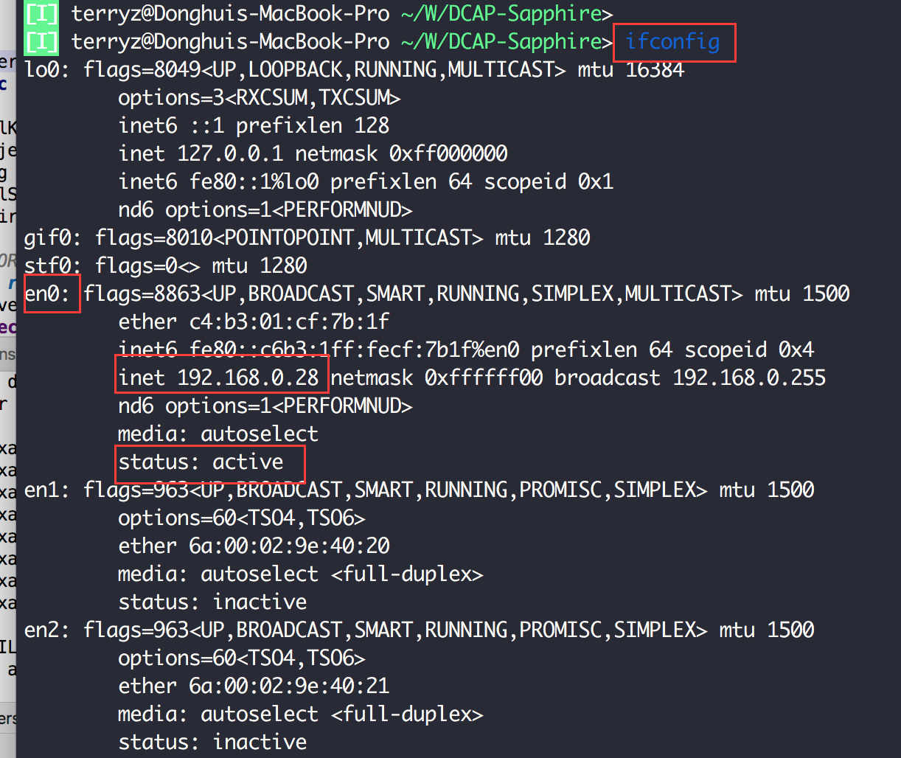
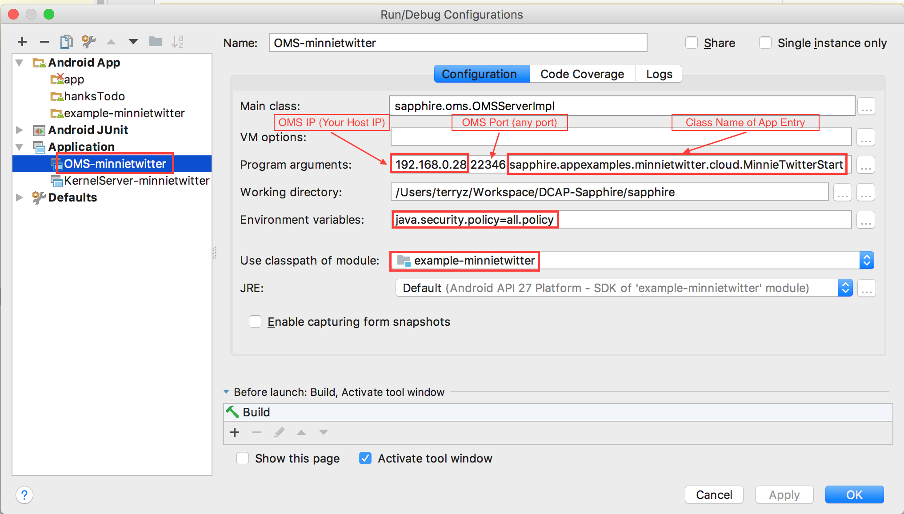
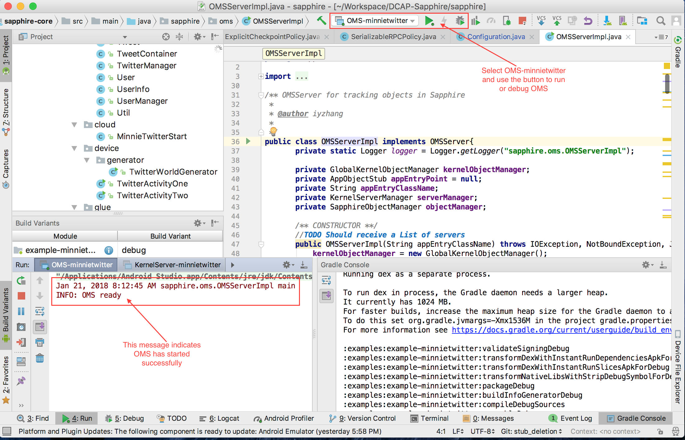
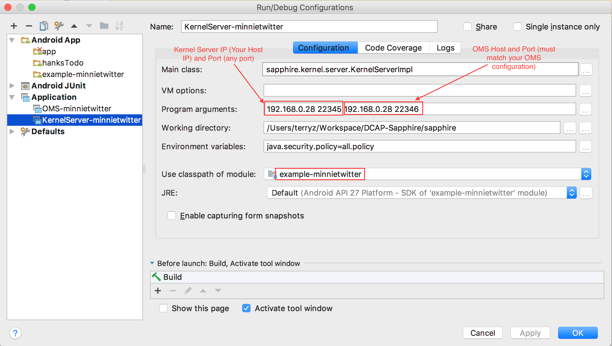
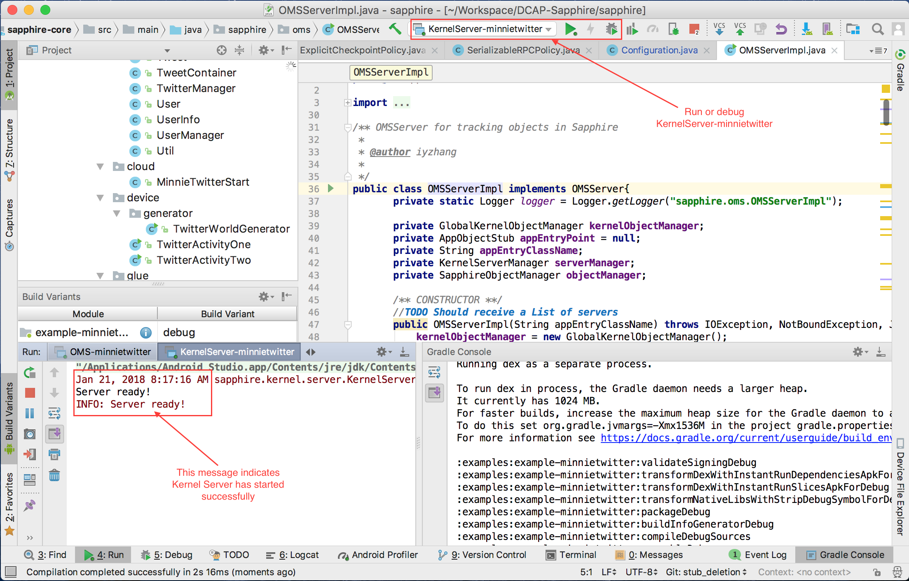
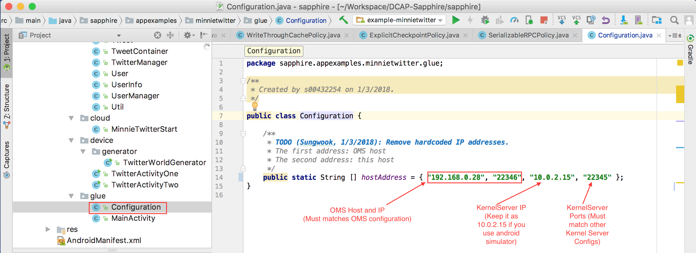
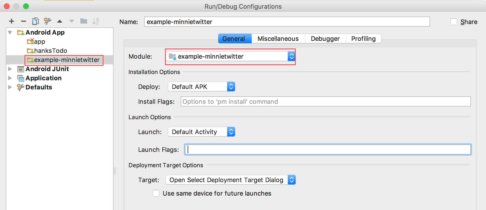
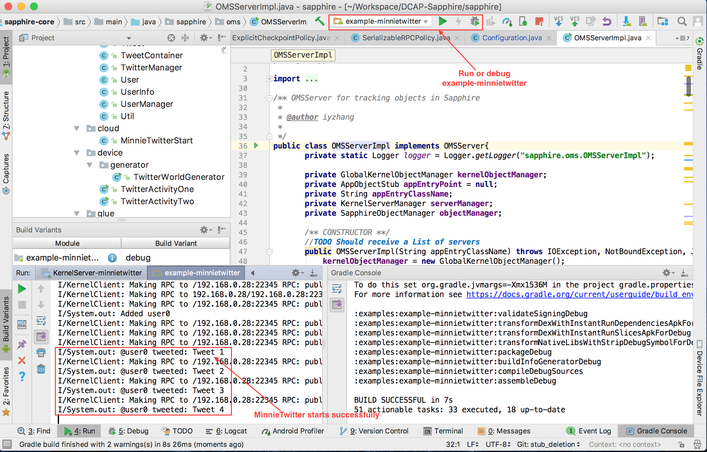
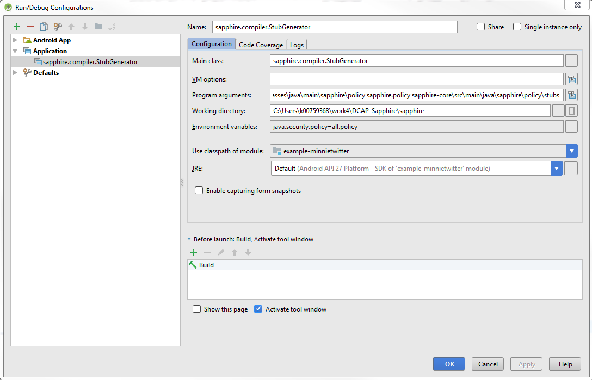

## Read Development Workflow
* DCAP team follows Kubernetes development workflow. Please read [Kubernetes Development Workflow Guide](https://github.com/kubernetes/community/blob/master/contributors/guide/github-workflow.md) closely.

## Install Android Studio
* Install Android Studio (Windows or Linux all are fine). Latest version or 3.0
* Download Gradle update if necessary (Android Studio will inform you).
* Install JDK (latest version) if you don't have one.

## Checkout Out Code
* Fork your own repository from [DCAP-Sapphire repository](https://github.com/Huawei-PaaS/DCAP-Sapphire) 
* `git clone` from your own repository
* Make sure to sync with the latest source before creating a pull request to Huawei-PaaS/DCAP-Sapphire.
* Make sure to rebase your code instead of simple git pull (read carefully about git pull part from above link).

## Open Project in Android Studio.
* Open Sapphire project from the local repo you just cloned. (i.e open DCAP-Sapphire/sapphire/)
* Android Studio will ask you about missing files - click OK.
* Sync Gradle. If it fails, just restart and try it again.
* Android Studio may show the bar for Gradle sync. If not: Tools>Android>Sync with Gradle files.
* Build project in Android Studio.

## Run MinnieTwitter in Simulator

#### Check Host IP
* Lookup your host IP and note it down


#### Configure OMS
* Go to `Run` -> `Edit Configurations...` in Android Studio
* Create configuration `OMS-minnietwitter` according to the following screen shot if it does not exist
* Specify the IP address and the port number on which OMS runs. If you plan to run OMS on your local desktop, then you can use the IP address you noted down in the previous step. 
* Specify the class name of the App Entry


#### Start OMS
* Go to `Run` menu in Android Studio, click `Run...`, and choose `OMS-minnietwitter` to start OMS
* You should see `OMS ready` message in console if OMS starts successfully


#### Configure Kernel Server
* Go to `Run` -> `Edit Configurations...` in Android Studio
* Create configuration `KermelServer-minnietwitter` according to the following screen shot if it does not exist
* Specify Kernel Server IP and port. Kernel server ip is the ip of the host on which you plan to start kernel server. It is usually your local host ip. 
* Specify OMS IP and port. OMS IP and port **must match** the ip and port you used to start OMS in the previous step.


#### Start Kernel Server
* Go to `Run` menu in Android Studio, click `Run...`, and then `KernelServer-minnietwitter` to start kernel server.
* You should see `Server ready!` messsage in console when kernel server starts up successfully


#### Configure MinnieTwitter
* Open `examples/example/minnietwitter/src/main/java/sapphire.appexamples.minnietwitter/glue/Configuration.java` in editor.
* Specify OMS IP and Port (the first two arguments). OMS IP and port **must match** the ip and port you used to start OMS.
* Specify Kernel Server IP and Port (the last two arguments). If you run the app on a real android device, then update it to the IP address of the real android device. If you run the app in simulator, then keep the ip as `10.0.2.15`.


* Go to `Run` -> `Edit Configuration...` in Android Studio
* Create configuration `example-minnietwitter` according to the following screen shot if it does not exist


#### Create Virtual Device
* When you run MinnieTwitter Android App, Android studio will pop up a Window to let you create a new virtual device (emulator) or you can register Android phone. For Huawei phone, please install HiSuite so you can see the device from Android Studio.
* Choose Oreo to download SDK and all other necessary components. This can take a while. You can choose any Nexus phones

#### Start MinnieTwitter
* Go to Android Studio `Run` menu, click on `Run...`, and choose `example-minnietwitter` to start minnietwitter
* You should see `Tweet 1` message in console if minnietwitter starts successfully



## Run OMS and Kernel Server in CLI
If you want to manually run a Sapphire kernel (e.g., want to run on a remote server), you can execute them by running the following script after copying the jar files. Please replace IP addresses and port number to your need as necessary. In the example, 192.168.10.231 22346 is the host address for OMS, and 192.168.10.231 31111 is the host address for Sapphire Kernel. Please first create a policy file with similar content as in the following for RMI to work.

**Notes: The following scripts are for Windows users. For Linux users, please replace `;` with `:`.**
```
grant {
  permission java.security.AllPermission;
};
```
OMS:
```
java -cp sapphire-core.jar;java.rmi.jar;minnietwitter.jar;apache.harmony.jar sapphire.oms.OMSServerImpl 192.168.10.231 22346 sapphire.appexamples.minnietwitter.cloud.MinnieTwitterStart
```

Sapphire Kernel:
```
java -Djava.security.manager -Djava.rmi.server.useCodebaseOnly=false -Djava.security.policy=./client.policy -cp sapphire-core.jar;java.rmi.jar;minnietwitter.jar;apache.harmony.jar sapphire.kernel.server.KernelServerImpl 192.168.10.231 31111 192.168.10.231 22346
```
## Stub File Generation

In order to create stubs for a DM (DMs)
1. First make sure the .class files already exist under `sapphire-core\build\classes\java\main\sapphire\policy`
If they do not exist, build the project first to create them.

2. Create an Application with the configuration in the following picture to run the main() method in class `sapphire.compiler.StubGenerator`. Running this Application will create the DM stubs for you.



## Troubleshooting
Android Studio can be unstable sometimes. Close all Android Studio projects and restart when you observe unexpected behavior.
Do not try to change Android Emulator as it can cause RMI incompatibility issue if not done properly.
If any of the process fails for some unknown reason, you may consider creating a new directory and clone the repository again.

* Emulator does not show up or ADB server initialization fails on Android Studio in Windows.
https://stackoverflow.com/questions/40618200/android-could-not-install-smartsocket-listener
Find which task is using 5037 port by the following commands:
netstat -ano | findstr :5037
tasklist | findstr processID (e.g tasklist | findstr 832)

If it is used by svchost.exe, I think it is wise to avoid killing this system process.
Run adb in a different port after setting up Environment variable:
adb -P 5038 start-server
In Windows, go to Environment Variables – Add a new one called ANDROID_ADB_SERVER_PORT and set it to whatever you want, e.g., 5038 (or 5039). Scroll down the to the screen show from below linked page:
https://stackoverflow.com/questions/3836571/changing-default-port-i-e-5037-on-which-adb-server-runs


