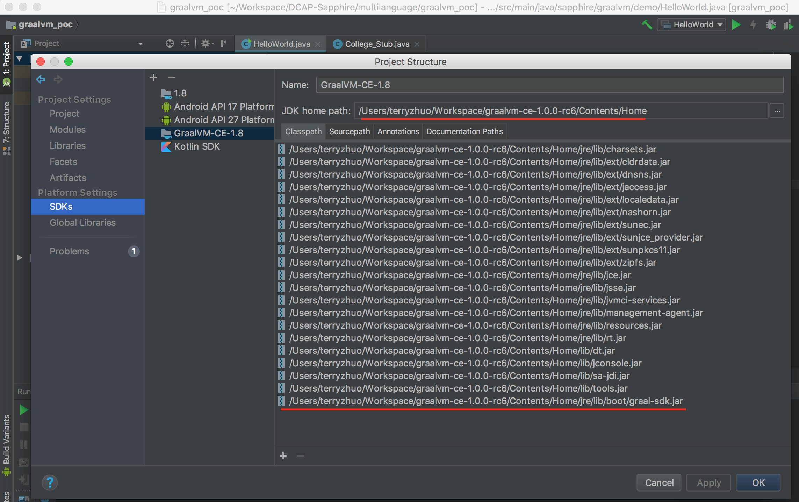

# Onboarding Process

* Send public GitHub account, Slack account and Huawei email address to Sungwook (sungwook.moon@huawei.com)
* Join [slack workspace](https://huawei.slack.com/)
* Get access to GitHub Repo by contacting Sungwook
* Read [papers](https://sapphire.cs.washington.edu/research/)
* Read [Sapphire source code](https://sapphire.cs.washington.edu/code.html)
* Read [code study notes](./docs/code_study/)
* Read [github workflow guide](https://github.com/kubernetes/community/blob/master/contributors/guide/github-workflow.md). Please follow this workflow to submit pull requests.
* Follows instructions in [this document](https://github.com/Huawei-PaaS/DCAP-Sapphire/blob/master/docs/Development.md) to set up environment
* Review the Principles of Distributed Systems. If you have not done a university course on distributed systems you will need to read the following to get a basic understanding of the principles and common terminology. Feel free to add more resource links below.
  * [UMass Course 677](http://lass.cs.umass.edu/~shenoy/courses/677/)
  * [Distributed System Principles by Andrew Tanenbaum](https://www.amazon.com/Distributed-Systems-Principles-Andrew-Tanenbaum/dp/153028175X)


# Quick Start
### Install Android SDK and Android Studio
* Follow [instructions](https://developer.android.com/studio/) to install Android SDK and Anroid Studio. More details can be found at [here](https://wiki.appcelerator.org/display/guides2/Installing+the+Android+SDK#InstallingtheAndroidSDK-InstallingAndroidSDKToolsonmacOS).
* Android SDK and Android Studio are *not* required by Sapphire. But many Sapphire demo applications are android applications. We recommend install Android SDK and Android Studio.
```shell
// on Mac
$ brew cask install android-sdk
$ brew cask install android-ndk
```

### Accept Android SDK License
```shell
/usr/local/share/android-sdk/tools/bin/sdkmanager --licenses
```

### Add Android Properties
```shell
> cd DCAP_Sapphire/sapphire
> cat >> local.properties  << EOF
ndk.dir=<your ndk dir>
sdk.dir=<your sdk dir>
EOF
```

### Checking out Sapphire
```shell
# checkout sapphire
> git clone https://github.com/Huawei-PaaS/DCAP-Sapphire

# set path to gradlew
> export PATH=$PATH:<path to gradlew>
```

### List Sapphire Projects
```shell
> cd DCAP_Sapphire/sapphire
> ./gradlew projects
```

### Clean Sapphire
```shell
# clean sapphire-core and dependencies
> cd DCAP_Sapphire/sapphire
> ./gradlew clean

# clean only sapphire-core
> ./gradlew :sapphire-core:clean
```

### Format Source Code
```shell
# format source code
> cd DCAP_Sapphire/sapphire
> ./gradlew goJF

# verify source code style
> ./gradlew verGJF
```

### Generate Policy Stub
```shell
> cd DCAP_Sapphire/sapphire/sapphire-core
> ../gradlew genPolicyStubs
```

### Build Sapphire
```shell
# build sapphire-core
> cd DCAP_Sapphire/sapphire/sapphire-core
> ../gradlew build

# build hankstodo
> cd DCAP_Sapphire/sapphire/examples/hanksTodo
> ../../gradlew build
```

### Publish Sapphire 
```shell
export BINTRAY_USER="<bintray_user>"
export BINTRAY_API_KEY="<bintray_api_key>"

# publish sapphire-core to bintray
> ./gradlew --info :sapphire-core:bintrayUpload

# publish apache harmony to bintray
> ./gradlew --info :apache.harmony:bintrayUpload
```

### Gradle Tips
```shell
> ./gradlew projects
> ./gradlew tasks --all
> ./gradlew properties
> ./gradlew jar
```

# Android Studio Setup

### Enable GraalVM SDK
To enbale GraalVM in Android Studio, you need to 1) add Graal SDK and 2) manually add `jre/lib/boot/graal-sdk.jar` in SDK classpath. Otherwise, Android Studio will not be able to resolve polyglot data types. 

