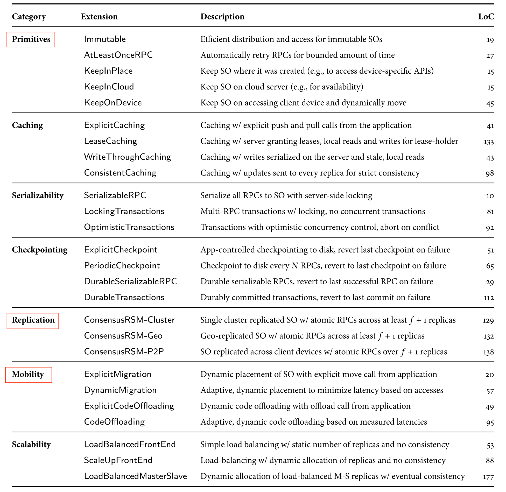

**Description on DM implementation has been moved to DMInternal.md.**

# DM List
Here are 26 DMs proposed in Sapphire paper. I will start by writing down my personal thoughts on each DM. The purpose is to trigger discussions within the team so that we can quickly build up consensus on the purpose, the implementation, and the value of each DM. 

I will assign a rate, LOW/MED/HIGH, to each DM to indicate its value to App developers. Again, it is my personal judgement. You are welcome to chime in with your opinions.

## Primitives

### Immutable (N/A) 19 LoC

> Efficient distribution and access for immutable SOs

Status: Implemented by Donghui https://github.com/Huawei-PaaS/DCAP-Sapphire/pull/50

Quinton: I guess that this means that a local read-only replica of this sapphire object can be instantiated at each client.  All reads go to the local replica, and all writes fail.  That is pretty trivial to implement, and practically very useful. useful. We should check with Irene that this was the intention.

Should *immutable* be a property declared on Sapphire object, or a DM? 

### AtLeastOnceRPC (LOW) 27 LoC
> Automatically retry RPCs for bounded amount of time

Status: Implemented by @h-w-chen https://github.com/Huawei-PaaS/DCAP-Sapphire/pull/19

This DM will retry failed operations until timeout is reached.

The value of this DM is rated because many SDKs provide similar retry mechanism. App developers have a lot of choices.

Quinton: The implementation of this DM is so simple that I think we should implement it anyway, so that app developers do not need to use a separate SDK for retries, unless they really want to.  Similarly, regarding the comment below, I think that a single retry policy across all operations on a given Sapphire objects is a fine place to start.  We can add per-operation retry configuration as and when actually required by an app.

By the way, to make this DM work properly, we have to make one change to the current DM mechanism:

* Provide Operation Level Support in DM: DMs today are proxies of Sapphire objects in which case DM logics are applied to all operations of a Sapphire object. Retry configuration, however, may vary a lot from operation to operation. DM should provide operation level support.

### KeepInPlace / KeepInRegion / KeepOnDevice (N/A) . 15/15/45 LoC

> Keep SO where it was created (e.g., to access device-specific APIs)

Terry: If I understand correctly, by default, SOs cannot move. In order to make a SO mobile, the SO must be managed by some special DM which has the object moving capability. Do we really need a `KeepInPlace` DM? If a SO is not supposed to move, we simply don't associate any DM to this SO. 

Terry: Rather than defining *KeepInPlace* as a DM, I feel that it is better to define it as annotation on *Sapphire objects*. If a *Sapphire object* is declared as *KeepInPlace*, then no DM should move it.

Should *KeepInRegion* and *KeepOnDevice* properties declared declared on Sapphire objects, or DM     simplementations?declared on

Quinton:
1. On failure, the DM presumably needs to recreate the sapphire object.  So even KeepInPlace needs to do this, on the same server where the original was.  
2. The DM associated with a Sapphire object (actually class) is in practise a kind of annotation (as discussed above).  So for consistency we should use one mechanism for this, even for KeepInPlace.

## Caching

### ExplicitCaching (LOW) 41 LoC

> Caching w/ explicit push and pull calls from application

Status: Implemented by @h-w-chen https://github.com/Huawei-PaaS/DCAP-Sapphire/pull/21

Not sure what it is...

### LeaseCaching 133 LoC

> Caching w/ server granting leases, local reads and writes for lease-holder

Status: Implemented by Irene.  https://github.com/Huawei-PaaS/DCAP-Sapphire/blob/master/sapphire/sapphire-core/src/main/java/sapphire/policy/cache/CacheLeasePolicy.java . Still needs unit tests.

Quinton: From Irene's thesis: "Figure 2.4 shows a simplified definition of the LeasedCaching DM that we provide in the Sapphire
Library. We include code for the Proxy component and the function declarations from the Instance
Manager. This DM does not have a Coordinator because it does not need centralized management.
The LeasedCaching DM is not replicated, so DK will only create one Instance Manager. The
Instance Manager hands out mutually exclusive leases to Proxies (which reside with the remote
reference to the SO) and uses timeouts to deal with failed Proxies. The Proxy with a valid lease can
read or write to a local copy of the SO. Read-only operations do not incur communication costs,
which saves latency over a slow network, but updates are synchronously propogated to the Instance
Manager in case of Proxy failure.
When the application invokes a method on an SO with this DM attached, the caller’s Proxy: 

1. verifies that it holds a lease, 
2. performs the method call on its local copy, 
3. checks whether the
object has been modified (using diff()), and 
4. synchronizes the remote object with its cached
copy if the object changed, using an update() call to the Instance Manager.

Each Proxy stores the lease in the Lease object (line 3) and a local copy of the Sapphire Object
(line 4). If the Proxy does not hold a valid lease, it must get one from the Instance Manager (line
8) before invoking its local SO copy. If the Proxy is not able to get the lease, the DM throws a
SONotAvailableException (line 10). The application is prepared for any RPC to an SO to fail, so it will
catch the exception and deal with it. The application also knows that the SO uses the LeasedCaching
SOM, so it understands the error string (line 11).
If the Proxy is able to get a lease from the Instance Manager, the lease will contain an up-to-date
copy of the SO (line 13). The Proxy will make a clean copy of the SO (line 17), invoke the method on
its local copy (line 18) and then diff the local copy with the clean copy to check for updates (line 19).
If the SO changed, the Proxy will update the Instance Manager’s copy of the SO (line 20). The copy
and diff is necessary because the Proxy does not know which SO methods might write to the SO,
thus requiring an update to the Instance Manager. If the DM had more insight into the SO (i.e., the
SO lets the DM know which methods are read-only), we could skip this step.
The example illustrates a few interesting properties of DMs. First, DM code is application agnostic
and can perform only a limited set of operations on the SO that it manages. In particular, it can
interpose only on method calls to its SO, and it manipulates the managed SO as a black box. For
example, there are DMs that automatically cache an SO, but no DMs that cache a part of an SO. This
ensures a clean separation of object management code from application logic and allows the DM to
be reused across different applications and objects.
Second, a DM cannot span more than one Sapphire Object: it performs operations only on the
object that it manages. We chose not to support cross-SO management because it would require
the DM to better understand the application; as well, it might cause conflicts between the DMs of
different SOs. As a result, there are DMs that provide multi-RPC transactions on a single SO, but we
do not support cross-SO transactions. However, the programmer could combine multiple Sapphire
Objects into one SO or implement concurrency support at the application level to achieve the same
effect.

### WriteThroughCaching (LOW) 43 LoC

> Caching w/ writes serialized to server and stale, local reads

Status: Implemented by @DonghuiZhuo https://github.com/Huawei-PaaS/DCAP-Sapphire/pull/20

*WriteThroughCache* directs write operations (i.e. mutable operations) onto cached object and through to remote object before confirming write completion. Read operations (i.e. immutable operations) will be invoked on cached object directly.

State changes on remote object caused by one client will not automatically invalidate to cached objects on other clients. Therefore *WriteThroughCache* may contain staled object.

Terry: The value of this DM is rated as LOW because 

* Many mutual cache libraries out there. 
* It is not difficult for developers to write their customized client side write through cache. It is not a big deal for them even if we don't provide this DM. 

To make *WriteThroughCache* work, DM needs a mechanism to distinguish *mutable* operations and *immutable* operations.

Quinton: Firstly, same argument as above for why we should implement this anyway.  It's dead simple, and avoids devs having to break out into some other APi to get caching behaviour. Secondly, the way mutable and immutable operations are distinguished in the Sapphire paper are using diff (on abject state before and after the operation.  It suggests (and I agree) that a method annotation would be a better approach.

### ConsistentCaching 98 LoC

> Caching w/ updates sent to every replica for strict consistency

Status: Not yet implemented (as of 2018-01-30).

*ConsistentCaching* caches Sapphire object instance on local machine. *Read* operations will be invoked on local cached object. *Write* operations will be directed to remote Sapphire object. If the Sapphire object has multiple *replicas*, *write* operations will be invoked on all replicas.

Terry: Should updates be propagated to all *replicas*, or be propagated to all *cached objects*? My interpretation is that the updates will be propagated to all replicas. The cached object, therefore, may contain stale data.

Quinton: My understanding is that the replicas are the cached objects.  So reads go to any replica, and writes go to all replicas.  We can confirm with Irene.  This is in practise quite difficult to do reliably (e.g. what happens if writes to some replicas fail, and the rollbacks to the successfully updated replicas fail to roll back etc).

Terry: What if the update propagation failed on some replica? 

Quinton: Aah yes, see above.

Terry: Should update propagation occur synchronously or asynchronously?

Quinton: Synchronously, otherwise replicas are only eventually consistent, not strictly consistent, as per the definition.

## Serializability

### SerializableRPC 10 LoC

> Serialize all RPCs to SO with server-side locking

Status: Implemented by @h-w-chen https://github.com/Huawei-PaaS/DCAP-Sapphire/pull/21

Main logic of this DM occurs on server side. Upon receiving a RPC request, *SerializableRPC* will 1) grab a lock on the Sapphire object, and 2) invoke the RPC on the Sapphire object. All method invocations on the Sapphire object will go through the lock and therefore will be serialized. 

* For Sapphire objects with multiple replicas, should RPCs be serialized across all replicas, or serialized against one specific replica?

### LockingTransactions 81 LoC

> Multi-RPC transactions w/ locking, no concurrent transactions

Status: Implemented by @quinton-hoole https://github.com/Huawei-PaaS/DCAP-Sapphire/pull/49

*LockingTransactions* uses lock to enforce the serial execution of transactions each of which consists of one or many RPC calls.

Terry: 
* Are serialization enforced across all Sapphire object replicas, or just against one Sapphire object replica? 
* Can users call methods on multiple Sapphire objects in one transaction, e.g. SO1.A() and SO2.B()?

### OptimisticTransactions 92 LoC

> Transactions with optimistic concurrency control, abort on conflict

Status: Not yet implemented.

## Checkpointing

### ExplicitCheckpoint 51 LoC

> App-controlled checkpointing to disk, revert last checkpoint on failure

Status: Implemented by @quinton-hoole https://github.com/Huawei-PaaS/DCAP-Sapphire/pull/36

*ExplicitCheckpoint* allows users to manually checkpoint Sapphire object state via `SO.checkpoint()` API. Sapphire object state will be saved on local host. Users can manually revert Sapphire object to the last checkpoint by calling `SO.revert()` API.

### PeriodicCheckpoint 65 LoC

> Checkpoint to disk every N RPCs, revert to last checkpoint on failure

Status: Implemented by @quinton-hoole https://github.com/Huawei-PaaS/DCAP-Sapphire/pull/37

*PeriodicCheckpoint* periodically, e.g. every N RPCs, saves Sapphire object state on local host. This DM saves Sapphire object before invokes any method on the Sapphire object. If RPC invocation succeeds, result will be returned to client. If RPC invocation fails, Sapphire object will be reverted to last checkpoint, and an error will be thrown to client.

### DurableSerializableRPC 29 LoC

> Durable serializable RPCs, revert to last successful RPC on failure

Status: Implemented by @quinton-hoole https://github.com/Huawei-PaaS/DCAP-Sapphire/pull/39

*DurableSerializableRPC* will 1) save Sapphire object state on local host, 2) grab a lock for the RPC call, and 3) invoke RPC on the Sapphire object. If RPC call succeeds, the result will be returned to client. If RPC call fails, the Sapphire object state will be restored, and an error will be thrown back to the client.  

Terry: * What is the difference between *DurableSerializableRPC* and *DurableTransactions*? Looks like *DurableSerializableRPC* deals with one RPC call, but *DurableTransactions* deals with multiple RPC calls in one transaction.

Quinton: Yes, Irene describes serializable consistency and transactions [here](https://irenezhang.net/blog/2015/02/01/consistency.html)

### DurableTransactions 112 LoC

> Durably committed transactions, revert to last commit on failure

Status: Not yet implemented.  Very similar to ExplicitTransactions plus DurableSerializableRPC above.  Should be trivial.  Quinton can do this.

*DurableTransactions* will 1) save Sapphire object state on local host, 2) grab a lock for the transaction, and 3) invoke multiple *update* operations specified in the transaction boundry on the Sapphire object. If any *update* operation fail, the Sapphire object state will be restored, and an error will be thrown back to the client.  

Terry:
* Can one transaction involve multiple Sapphire object?
* If the Sapphire object has multiple replicas, should the updates be propagated to other replicas?

## Replication

Quinton: These are essentially all identical except for where the replicas live - in the same cluster/cloud zone, across zones in a cloud region/geo-location, across cloud regions, or across mobile devices (P2P).

### ConsensusRSM-cluster 129 LoC

> Single cluster replicated SO w/ atomic RPCs across at least f + 1 replicas

Status: Implementation started by @quinton-hoole (2018-01-30).  Will form part of HA demo in Feb/Mar 2018.

Quinton: This is essentially the [PAXOS](https://en.wikipedia.org/wiki/Paxos_(computer_science)) or [Raft](https://en.wikipedia.org/wiki/Raft_(computer_science)) consensus algorithms.  It seems impossible to implement even rough approximations of these effectively in 130 lines of code without using existing consensus libraries (e.g. [etcd](https://github.com/coreos/etcd), or [raft](https://raft.github.io/)). 

Terry: I have a different interpretation. According to the DM description, I don't think the author plans to achieve strong consistency and consensus as provided by PAXOS or Raft. It looks to me that this DM just tries to provide quorum based rpc calls. When client issues a RPC request to a Sapphire object, the DM (either the client side proxy or the server side proxy) will send the RPC request to 2f replicas, returns *success* if the RPC call succeeded on f + 1 replicas, throws exception otherwise. 

Quinton: Yes, the problem with that simple approach is that it doesn't work properly in practise.  That's precisely why PAXOS or RAFT or equivalent consensus algorithms are required, to cover all the edge cases. We could certainly start with the simple approach as you describe, but it's not useful in production, and we'll eventually need to use PAXOS or RAFT, I'm pretty sure.  More detail here:  https://en.wikipedia.org/wiki/Consensus_(computer_science)

### ConsensusRSM-Geo 132 LoC

> Geo-replicated SO w/ atomic RPCs across at least f + 1 replicas

Status: Not yet implemented.  Trivial extension of the above across zones/geographies.

Quinton: See above.

### ConsensusRSM-P2P 138 LoC

> SO replicated across client devices w/ atomic RPCs over f + 1 replicas

Status: Not yet implemented.

Quinton: From Irene's thesis: "Peer-to-peer. We built peer-to-peer DMs to support the direct sharing of SOs across client mobile
devices without needing to go through the cloud. These DMs dynamically place replicas on nodes
that contain references to the SO. We implemented the DM using a centralized Coordinator that
attempts to place replicas as close to the callers as possible, without exceeding an application-specified
maximum number of replicas. We show the performance impact of this P2P scheme in Section 2.7."

## Mobility

> Quinton: From Irene's thesis: 
> Code-offloading. The code-offloading DMs are useful for compute-intensive applications. The
CodeOffloading DM supports transparent object migration based on the performance trade-off
between locating an object on a device or in the cloud, while the ExplicitCodeOffloading DM allows
the application to decide when to move computation. The ExplicitCodeOffloading DM gives the
application more control than the automated CodeOffloading DM, but is less transparent because
the SO must interact with the DM.
Once the DK creates the Sapphire Object on a mobile device, the automated CodeOffloading DM
replicates the object in the cloud. The device-side DM Instance Manager then runs several RPCs
locally and asks the cloud-side Instance Manager to do the same, calculating the cost of running
on each side. An adaptive algorithm, based on Q-learning [214], gradually chooses the lowest-cost
option for each RPC. Periodically, the DM retests the alternatives to dynamically adapt to changing
behavior since the cost of offloading computation depends on the type of computation and the
network connection, which can change over time.

Quinton: It seems that CodeOffloading as described above is only suitable for operations that do not read or write state, or only read immutable state.  Otherwise the method invocation cannot be done interchangably on different replicas (e.g. either on a mobile device or a cloud server).  Or else such a code offloading DM needs to be combined with Consistent or Explicit caching.  That way the operation can be executed on any replica, and the resulting state changes propagated to the copies where it was not executed?  Or else the objects need to be migrated to a particular location where all mutating operations need to be invoked.  But for SO's with multiple clients, this seems effectively impossible (e.g. if multiple mobile devices access the same SO, that SO cannot reside on either of the mobile devices - it must reside e.g. on a cloud machine). This whole concept of code offloading vs migration is quite vague and confusing to me.  We need to discuss further with UW/Irene.

### ExplicitMigration 20 LoC

> Dynamic placement of SO with explicit move call from application

Status: Implemented by [Malepati Bala Siva Sai Akhil](https://huawei.slack.com/team/U8KLR4NRK)  https://github.com/Huawei-PaaS/DCAP-Sapphire/pull/53

Quinton: The intention here is fairly clear, but exactly what calls the application is required to make to move the object are not.  In theory, according to the paper:

getNodes() Get list of all nodes
pin(node) Move SO to a node.

But those functions don't actually exist in the code.  So we need to decide what those calls should look like.  I'm not convinced that this is very useful in practise - ideally placement would be done by a DM, with requirement information provided by the app where necessary (e.g. "place me near these SO's"). I don't really like the idea of placement logic bleeding to the application - that's what Sapphire is supposed to avoid.  This sentiment is echo'd in Irene's thesis above.

Assume that the general intention is as follows: 
1. When the SO is created, the system decides where to place it (initially this could be random - the current implementation just [places it on the first available server](https://github.com/Huawei-PaaS/DCAP-Sapphire/blob/master/sapphire/sapphire-core/src/main/java/sapphire/oms/OMSServerImpl.java#L133)).
2. The application can discover where the system placed it, and request it to be moved to a different server if required.

### DynamicMigration 57 LoC

> Adaptive, dynamic placement to minimize latency based on accesses

Status: Not yet implemented.  @Donghui-Zhuo and Olesya Melnichenko <olesya.melnichenko@huawei.com> are looking into it.

Quinton: This one seems quite tricky, but super-valuable.  Here's an initial proposal (although it's not clear how to fit this into 57 LoC.  We should discuss this with UW/Irene.

1. Initial placement is random as above.
2. If the SO is a server only (incoming RPC's only)
  * Server-side of DM keeps track of a sliding window of clients that have accessed it in the recent past (configurable), and a weighted average of latencies to each client (ideally using timestamps on the RPC requests, but that's subject to client-server clock skew, so we need to think more about this - probably need round trip delay from the server to the client and back instead). Terry: RPC latency is relatively easy. We can be measured it at client side by client side proxy of the DM. This latency includes server side latency (i.e. processing time on server) and the data transmitting time. This latency is a relative value so it will be not affected by clock skews.  (quinton: Yes, but the client needs to propagate that data to the server somehow - that's what I was getting at.  Se we either need to measure the latency at the server end, or find a way to propagate the latency data from the client to the server - or some other agent that knows the latencies from all clients, and can move the server appropriately).
3. TODO...
4. If the SO is a client only... (needs to be moved as close to all it's servers as possible).
5. If the SO is both a client and a server (combination of client and server cases above - it seems that to do this properly we will need to build a call graph of the entire sapphire application, and optimize the whole graph.  Something like [flow graphs](https://en.wikipedia.org/wiki/Flow_network) might prove useful.  We have some existing research collaboration with [Ionel Gog](https://www.cl.cam.ac.uk/~icg27/) at Cambridge University on [this stuff](http://firmament.io/)). 
Terry: Placement decision is the hard part. Suppose a sapphire object serves multiple clients. Moving the object close to one client may cause the RPC latency increase on other clients. We need to find a global optimal placement for the Sapphire object, not just good for one client.  Second, the root cause of bad latency is often not clear. Suppose a client experience bad latency on one API. Will the latency be reduced if we move the Sapphire object close to the client? Maybe, maybe not. 
Quinton: Agreed.  Placement seems hard.  Irene mentioned using [Q-learning](https://en.wikipedia.org/wiki/Q-learning) which is non-trivial, and supports the assertion that there is no obvious simple algorithm.  See also the flow graph discussion above.

### ExplicitCodeOffloading 49 Loc

> Dynamic code offloading with offload call from application

Status: Not yet implemented (2018-01-30)

### CodeOffloading 95 LoC

> Adaptive, dynamic code offloading based on measured latencies

Status: Not yet implemented (2018-01-30)

* What exactly is the difference between Offloading and Migration

## Scalability

### LoadBalancedFrontend 53 LoC

> Simple load balancing w/ static number of replicas and no consistency

Status: Implemented by @SrinivasChilveri (https://github.com/Huawei-PaaS/DCAP-Sapphire/pull/70)

Quinton: On the client side of the DM for a server Sapphire Object, all RPC's to a server Sapphire Object from a given client are load balanced (using simple round robin load balancing) equally across all replicas of the server Sapphire Object.  More details on Round Robin load balancing are available [here](http://www.jscape.com/blog/load-balancing-algorithms).  Each client side DM instance should randomise the order in which it performs round robin against replicas, so that all clients do not target replicas in the same order, leading to unbalanced load.

* In the initial implementation:
  * load balancing should be implemented inside the DM.  In future load balancing DM's, we can delegate the load balancing to an external load balancing system (e.g. [istio](https://istio.io/)
  * no attempt needs to be made to perform health checking against replicas.  If a replica is dead or slow, calls to it are simply slow or result in errors.  In future load balancing DM's, we can add health checking, retries etc.
  * if new replicas of the SO are added (by some agent outside of the DM), these replicas are simply added to round robin rotation, with no attempt made to backfill additional load to the new, relatively idle replicas.  In future versions, such additional features can be added.
  * a configurable value for the number of concurrent requests supported per replica per should be provided.  This should be enforced on the server side of the DM.  If the number of concurrent requests against a given replica exceeds that number, requests to that server replica should fail (in the server DM) with an appropriate exception (indicating server overload).  In a later version, a configurable length client-side and/or server side queue can be added to deal better with such overload situations..
  
### ScaleUpFrontend 88 LoC

> Load-balancing w/ dynamic allocation of replicas and no consistency

Status: Not yet implemented (2018-01-30)

Quinton: As above, but when a given replica reaches it's full capacity (see above), the server-side DM for that replica should create one additional replica.  A given server-side DM instance should not create more than 1 replica per n milliseconds (with n being configurable).  This is to limit the rate at which scale-up can occur.  When the load at a given replica drops to approximately p * (m-2)/m (where m is the current number of replicas, and p is the maximum concurrency setting per replica), then the server-side DM for that replica should remove one replica (randomly chosen).  This is because there are in theory two more replicas than required, so one can be removed.  The number of replicas should not be reduced below 2 (in case one fails).  The aforementioned algorithm is inadequate in a production environment, but is good enough to illustrate the concept.  In later versions, more sophisticated and configurable scale-up and scale-down algorithms can be implmented, and DM's which offload scale-up to external agents (e.g. istio, kubernetes HPA or similar) can be implemented.

SrinivasChilveri:
if we implement the Scaleup Logic in ServerSide DM then we may end up creating/scaling up multiple replicas in short duration {suppose we have 3 replicas and all are over loaded then all the server DMs tries to scale up  so we may end up 6 replicas, of course if the request rate comes down then it may scale down but scaling up more than 1 in short duration may not be a good idea} so if we implement the scale up logic in the group DM then group might receive scale up requets from 3 Servers in 10 milli seconds but group will scale up only one replica instead of scaling up 3 replicas. what do you say?

### LoadBalancedMasterSlave 177 LoC

> Dynamic allocation of load-balanced M-S replicas w/ eventual consistency

Status: Not yet implemented (2018-01-30) @Donghui is working on it.

Quinton: As above for read requests (i.e read requests are load balanced across all replicas, with auto-scale-up and scale-down of replicas).  In addition, write requests are all directed to an elected master replica, that (asynchronously) replicates all writes to all replicas (with retries on failures - see AtLeasetOnceRPC as above).  In the inital version, simple master election will be implmented by all client-side DM's selecting the lowest numbered existing replica as the master.  In later versions, more sophisticated master election can be implemented (e.g. by adding health checks, removal of non-responsive master, and using an external etcd/zookeeper or similar to manage master election in the standard way, e.g. [like this](https://www.projectcalico.org/using-etcd-for-elections/) or [this](http://techblog.outbrain.com/2011/07/leader-election-with-zookeeper/).
