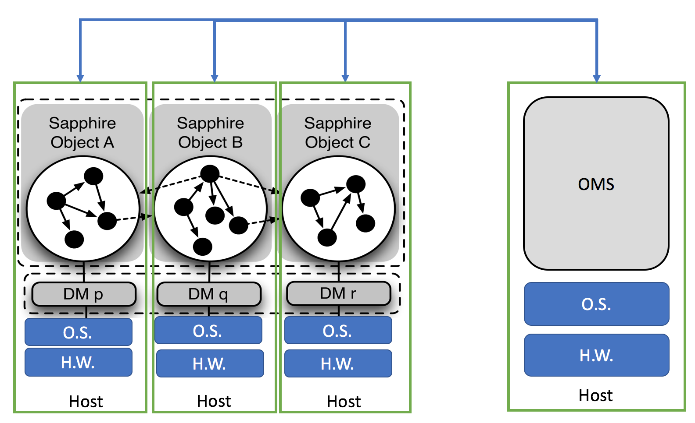

# DM Implementation
Sapphire paper mentions that every DM has three components: a *proxy*, a *instance manager*, and a *coordinator*. The terminologies you see in [source code](https://github.com/Huawei-PaaS/DCAP-Sapphire/blob/master/sapphire/sapphire-core/src/main/java/sapphire/policy/SapphirePolicyUpcalls.java), however, are different from the ones used in the paper. In source code, they are  called *ClientSidePolicy*, *ServerSidePolicy*, and *GroupPolicy*. (This is my understanding. Correct me if I am wrong.) To implement a DM means to write a class that implements the aforementioned three interfaces.

The following interface definitions were copied from [sapphire source  code](https://github.com/Huawei-PaaS/DCAP-Sapphire/blob/master/sapphire/sapphire-core/src/main/java/sapphire/policy/SapphirePolicyUpcalls.java). Be aware that this is **not the final version**. They are subject to future changes. For example, sapphire paper also mentions `onDestroy`, `onLowMemory`, and `onHighLatency` in interfaces. We probably need to add these functions into the interface later. 

```java
// proxy interface
public interface  SapphireClientPolicyUpcalls extends Serializable {
	public void onCreate(SapphireGroupPolicy group);
	public void setServer(SapphireServerPolicy server);
	public SapphireServerPolicy getServer();
	public SapphireGroupPolicy getGroup();
	public Object onRPC(String method, ArrayList<Object> params) throws Exception;
}

// instance manager interface
public interface SapphireServerPolicyUpcalls extends Serializable {
	public void onCreate(SapphireGroupPolicy group);
	public SapphireGroupPolicy getGroup();
	public Object onRPC(String method, ArrayList<Object> params) throws Exception;
	public void onMembershipChange();
}
	
// coordinator interface
public interface SapphireGroupPolicyUpcalls extends Serializable {
	public void onCreate(SapphireServerPolicy server);
	public void addServer(SapphireServerPolicy server);
	public ArrayList<SapphireServerPolicy> getServers();
	public void onFailure(SapphireServerPolicy server);
	public SapphireServerPolicy onRefRequest();
}
```
# DM Usage
App developers use a DM by passing the name of DM class as a generic type to `SapphireObject` interface. In the following example, `UserManager` declares to use DM `DHTPolicy` to manage its users.

```java
public class UserManager implements SapphireObject<DHTPolicy>, DHTInterface {
	Map<DHTKey, User> users;
	private TagManager tm;
    ...
}
```

Again, this is subject to change. We may use Java annotation down the road.

```java
@SapphireObject
@Proxy(name="DHTClient", 
@InstanceManager(name="DHTServer")
@Coordinator(name="DHTCoordinator")
public class UserManager {
}
```
# DM Injection



In the above diagram, the dashed arrow lines are remote method invocations between Sapphire objects, the solid arrow lines are local method invocations within a Sapphire object (i.e. within JVM). DMs sit below Sapphire objects. They are essentially proxies for Sapphire objects. When one object calls a remote method on another Sapphire object, the request will first be processed by the DM on client side, (i.e. `DM.Proxy`), the DM on server side (i.e. `DM.InstanceManager`) , and then finally be sent to the real Java object.

As shown in the following diagram, DM consists of many automatically generated components. All these components are wired up by DCAP automatically. Therefore as an App developer, you cannot use normal Java `new` keyword to create a Sapphire object. Sapphire objects have to be created by [`Sapphire._new()`](https://github.com/Huawei-PaaS/DCAP-Sapphire/blob/master/sapphire/sapphire-core/src/main/java/sapphire/runtime/Sapphire.java). Moreover, to invoke a method on an Sapphire object, you must first get the reference to object from OMS - OMS will return a *stub* of the actual Sapphire object.
 


# DM List
Here are 26 DMs proposed in Sapphire paper. I will start by writing down my personal thoughts on each DM. The purpose is to trigger discussions within the team so that we can quickly build up consensus on the purpose, the implementation, and the value of each DM. 

I will assign a rate, LOW/MED/HIGH, to each DM to indicate its value to App developers. Again, it is my personal judgement. You are welcome to chime in with your opinions.


### Immutable (N/A)
> Efficient distribution and access for immutable SOs

<span style="color:blue">Should *immutable* be a property declared on Sapphire object, or a DM?</span> 

### AtLeastOnceRPC (LOW)
> Automatically retry RPCs for bounded amount of time

This DM will retry failed operations until timeout is reached.

The value of this DM is rated because many SDKs provide similar retry mechanism. App developers have a lot of choices.

By the way, to make this DM work properly, we have to make one change to the current DM mechanism:

* Provide Operation Level Support in DM: DMs today are proxies of Sapphire objects in which case DM logics are applied to all operations of a Sapphire object. Retry configuration, however, may vary a lot from operation to operation. DM should provide operation level support.


### KeepInPlace / KeepInRegion / KeepOnDevice (N/A)
> Keep SO where it was created (e.g., to access device-specific APIs)

If I understand correctly, by default, SOs cannot move. In order to make a SO mobile, the SO must be managed by some special DM which has the object moving capability. Do we really need a `KeepInPlace` DM? If a SO is not supposed to move, we simply don't associate any DM to this SO. 

Rather than defining *KeepInPlace* as a DM, I feel that it is better to define it as annotation on *Sapphire objects*. If a *Sapphire object* is declared as *KeepInPlace*, then no DM should move it.

<span style="color:blue">Should *KeepInRegion* and *KeepOnDevice* properties declared declared on Sapphire objects, or DM     simplementations?</span>declared on

### ExplicitCaching (LOW)
> Caching w/ explicit push and pull calls from application

<span style="color:blue">Not sure what it is...</span>

### WriteThroughCaching (LOW)
> Caching w/ writes serialized to server and stale, local reads

*WriteThroughCache* directs write operations (i.e. mutable operations) onto cached object and through to remote object before confirming write completion. Read operations (i.e. immutable operations) will be invoked on cached object directly.

State changes on remote object caused by one client will not automatically invalidate to cached objects on other clients. Therefore *WriteThroughCache* may contain staled object.

The value of this DM is rated as LOW because 

* Many mutual cache libraries out there. 
* It is not difficult for developers to write their customized client side write through cache. It is not a big deal for them even if we don't provide this DM. 

<span style="color:blue">To make *WriteThroughCache* work, DM needs a mechanism to distinguish *mutable* operations and *immutable* operations.</span>

### ConsistentCaching
> Caching w/ updates sent to every replica for strict consistency

*ConsistentCaching* caches Sapphire object instance on local. *Read* operations will be invoked on local cached object. *Write* operations will be directed to remote Sapphire object. If the Sapphire object has multiple *replicas*, *write* operations will be invoked on all replicas.

* Should updates be propagated to all *replicas*, or be propagated to all *cached objects*? My interpretation is that the updates will be propagated to all replicas. The cached object, therefore, may contain stale data.
* What if the update propagation failed on some replica? 
* Should update propagation occur synchronously or asynchronously?


### SerializableRPC
> Serialize all RPCs to SO with server-side locking

Main logic of this DM occurs on server side. Upon receiving a RPC request, *SerializableRPC* will 1) grab a lock on the Sapphire object, and 2) invoke the RPC on the Sapphire object. All method invocations on the Sapphire object will go through the lock and therefore will be serialized. 

* For Sapphire objects with multiple replicas, should RPCs be serialized across all replicas, or serialized against one specific replica?

### LockingTransactions
> Multi-RPC transactions w/ locking, no concurrent transactions 

*LockingTransactions* uses lock to enforce the serial execution of transactions each of which consists of one or many RPC calls.

* How do users specify transaction boundary? Say, I would like to put operation A and B into one transaction, how do I specify it in DM?
* Are serialization enforced across all Sapphire object replicas, or just against one Sapphire object replica?
* Should this DM take care of state rollback from failed transactions?
* Can users call methods on multiple Sapphire objects in one transaction, e.g. SO1.A() and SO2.B()?

### ExplicitCheckpoint
> App-controlled checkpointing to disk, revert last checkpoint on failure

*ExplicitCheckpoint* allows users to manually checkpoint Sapphire object state via `SO.checkpoint()` API. Sapphire ojbect state will be saved on local host. Users can manually revert Sapphire object to the last checkpoint by calling `SO.revert()` API.

* Description says *revert last checkpoint on failure*. Is this *revert* done by system, or by users manually?
* If *revert* is performed by system automatically, then *on which failures* should the system revert Sapphire object to last checkpoint?

### PeriodicCheckpoint
> Checkpoint to disk every N RPCs, revert to last checkpoint on failure

*PeriodicCheckpoint* periodically, e.g. every N RPCs, saves Sapphire object state on local host. This DM saves Sapphire object before invokes any method on the Sapphire object. If RPC invocation succeeds, result will be returned to client. If RPC invocation fails, Sapphire object will be reverted to last checkpoint, and an error will be thrown to client.

* What is the use case of this DM?
* What if a Sapphire object dies? Will we loose checkpoint data?

### DurableSerializableRPC
> Durable serializable RPCs, revert to last successful RPC on failure

*DurableSerializableRPC* will 1) save Sapphire object state on local host, 2) grab a lock for the RPC call, and 3) invoke RPC on the Sapphire object. If RPC call succeeds, the result will be returned to client. If RPC call fails, the Sapphire object state will be restored, and an error will be thrown back to the client.  

* What is the difference between *DurableSerializableRPC* and *DurableTransactions*? Looks like *DurableSerializableRPC* deals with one RPC call, but *DurableTransactions* deals with multiple RPC calls in one transaction.

### DurableTransactions
> Durably committed transactions, revert to last commit on failure

*DurableTransactions* will 1) save Sapphire object state on local host, 2) grab a lock for the transaction, and 3) invoke multiple *update* operations specified in the transaction boundry on the Sapphire object. If any *update* operation fail, the Sapphire object state will be restored, and an error will be thrown back to the client.  

* Can one transaction involve multiple Sapphire object?
* If the Sapphire object has multiple replicas, should the updates be propagated to other replicas?

### CodeOffloading
* What is the difference between Offloading and Migration


