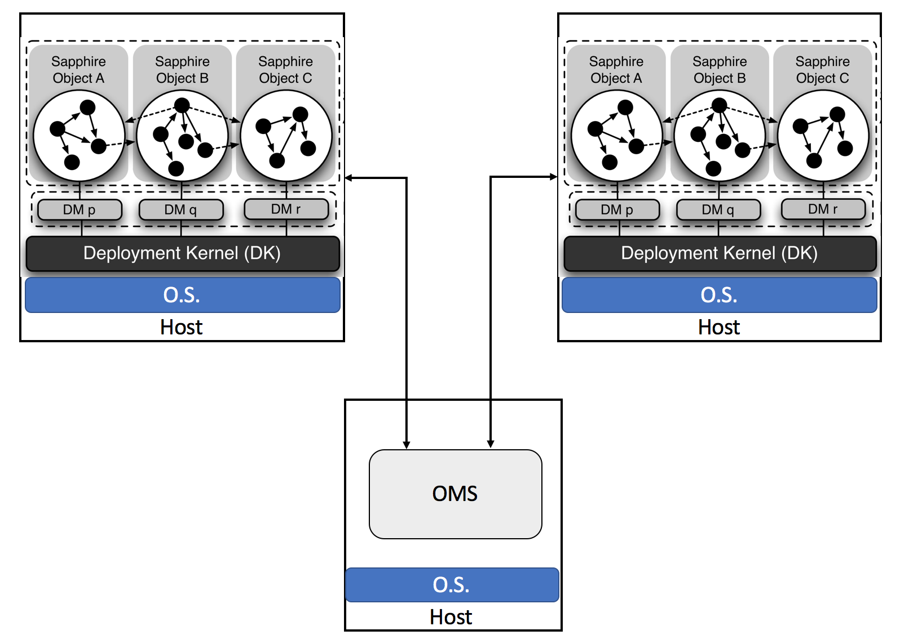
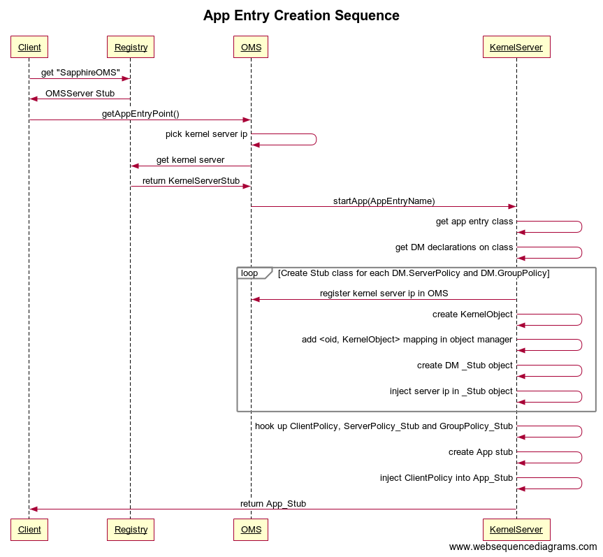

# Sapphire Overview



### Sapphire Object
Sapphire object is the base management unit in Sapphire. In above diagram, each circle represents one Sapphire object. The dots inside the circle (i.e. the Sapphire object) represents normal Java objects. One Sapphire object may contain a set of Java objects. The solid arrow lines between dots are *local* method invocations between Java objects. The dashed arrow lines between circles are *remote* method invocations between Sapphire objects. Methods on normal Java objects can only be invoked *locally* by objects reside on the same host. Sapphire objects however may have *remote methods* which can be invoked by objects reside on different hosts. 

Deployment Kernel has the capability to move a Sapphire object from one host to another. Behind the scene, Deployment Kernel will serialize the whole Sapphire object, including all Java objects belong to the Sapphire object, on one end, ships the bytes to the destination host, and then do the deserialization there.

Sapphire objects are created by applications with static helper method `Sapphire.new_()`. To invoke a method on a Sapphire object, applications have to first get a reference to the Sapphire object from OMS Server. 

### OMS
OMS, Object Management Service, keeps track of the location of all Sapphire objects. Unlike normal Java objects which can be created by Java `new` keyword, Sapphire object must be created with a special Sapphire helper method `Sapphire.new_`. Upon Sapphire object creation, method `Sapphire.new_` will generate a globally unique ID for the Sapphire object, and register the object in OMS. OMS provides API to search Sapphire objects. Given a Sapphire object ID, OMS can tell the IP of the host on which the Sapphire object runs. Whenever a Sapphire object is moved or deleted, OMS will be updated accordingly.

### Kernel Server
Kernel Server provides runtime environment for Sapphire objects. Each host runs a Kernel Server instance. Kernel Server exposes a set of *remote* API which can be invoked remotely. Sapphire assumes that any Kernel Server can invoke the *remote* API on any other Kernel Server regardless where the Kernel Server lives.

### DM
Every DM, Deployment Manager, has three components: a proxy, a instance manager, and a coordinator. When users create Sapphire object, he/she can optionally associate a DM to the Sapphire object. Not all Sapphire object has DMs. But if a DM is specified for a Sapphire object, then during the creation of the Sapphire object, helper method `Sapphire.new_` will inject codes into the `stub` of the Sapphire object, in which case any method invocation on the Sapphire object will first be processed by the `proxy`, `instance manager` and the `coordinator` of the DM before reach the actual Sapphire object. Each DM provides one specific functionality. The Sapphire paper listed 26 DMs. 

### Kernel Object
*Kernel object* is a wrapper of the *actual* Java object - it contains a reference to the actual Java object and exposes a `invoke` method which allows any public methods defined on the actual Java object to be invoked with reflection.

Kernel objects are created with [`KernelServerImpl.newKernelObject`](https://github.com/Huawei-PaaS/DCAP-Sapphire/blob/master/sapphire/sapphire-core/src/main/java/sapphire/kernel/server/KernelServerImpl.java#L101) method. Every kernel object has a unique `oid` and is registered in OMS server. `KernelServer` interface also exposes a few APIs to copy and move kernel objects.

# Remote Interfaces

Sapphire declares two `Remote` interfaces: `KernelServer` and `OMSServer`. Most methods in these two interfaces can be easily replaced with `gRPC`, except for `KernelServer.copyKernelObject`.

### `KernelServer`

```java
public interface KernelServer extends Remote {
	Object makeKernelRPC(KernelRPC rpc) throws RemoteException, KernelObjectNotFoundException, KernelObjectMigratingException, KernelRPCException;
	void copyKernelObject(KernelOID oid, sapphire.kernel.server.KernelObject object) throws RemoteException, KernelObjectNotFoundException;
	AppObjectStub startApp(String className) throws RemoteException;
}
```

###`OMSServer`
```java
public interface OMSServer extends Remote {
       KernelOID registerKernelObject(InetSocketAddress host) throws RemoteException;
       void registerKernelObject(KernelOID oid, InetSocketAddress host) throws RemoteException, KernelObjectNotFoundException;
       InetSocketAddress lookupKernelObject(KernelOID oid) throws RemoteException, KernelObjectNotFoundException;
       
       ArrayList<InetSocketAddress> getServers() throws NumberFormatException, RemoteException, NotBoundException;
       ArrayList<String> getRegions() throws RemoteException;
       InetSocketAddress getServerInRegion(String region) throws RemoteException;
       
       void registerKernelServer(InetSocketAddress host) throws RemoteException, NotBoundException;
       
       SapphireObjectID registerSapphireObject(EventHandler dispatcher) throws RemoteException;
       SapphireReplicaID registerSapphireReplica(SapphireObjectID oid, EventHandler dispatcher) throws RemoteException, SapphireObjectNotFoundException;
       EventHandler getSapphireObjectDispatcher(SapphireObjectID oid) throws RemoteException, SapphireObjectNotFoundException;
       EventHandler getSapphireReplicaDispatcher(SapphireReplicaID rid) throws RemoteException, SapphireObjectNotFoundException;
       
       /* Called by the client */
       public AppObjectStub getAppEntryPoint() throws RemoteException;
}
```

As a remote procedure call framework, `gPRC` does not provide a mechanism to move *objects* from one host to another. *Objects* are different from `gRPC` *messages* because objects may have methods. But we can build this *object moving* capability on top of `gRPC` by taking the following three actions:

* Serialize the object into a byte stream on client side
* Pass the byte stream to server side by calling a `gRPC` function on the server
* Deserialize byte stream into object on server side

However there is one catch. In order to deserialize an object, the server on which the object will be deserialized needs the access to the class definition. `ClassNotFoundException` will be thrown if the server cannot find the class definition on the class path. Unlike `RMI`, `gRPC` is not able to dynamically download class definition from a remote location, therefore we need to build up a mechanism to allow servers to download jar files remotely. 

In the first phase, to keep things simple, we can assume that there is one single jar file which contains all class definitions and this jar file is accessible to all servers.

# RMI Registry 

Sapphire uses RMI registry to discover remote objects. The following snippet shows how to register remote object *SapphireOMS*. 

```java
// Register SapphireOMS
OMSServerImpl oms = new OMSServerImpl(args[2]);
sapphire.oms.OMSServer omsStub = (sapphire.oms.OMSServer) UnicastRemoteObject.exportObject(oms, 0);
Registry registry = LocateRegistry.createRegistry(port);
registry.rebind("SapphireOMS", omsStub);
```

Client side lookups remote object `OMSServer` by its name, i.e. *SapphireOMS*, and RMI registry returns a *stub* of `OMSServer`. Client then uses OMS server to look up Sapphire objects. 

```java
// Look up SapphireOMS
registry = LocateRegistry.getRegistry(args[0],Integer.parseInt(args[1]));
OMSServer server = (OMSServer) registry.lookup("SapphireOMS");

// Look up Sapphire object from OMS Server
TwitterManager tm = (TwitterManager) server.getAppEntryPoint();
System.out.println("Received Twitter Manager Stub: " + tm);
```

If we switch to `gRPC`, we can no longer use RMI registry. We need to come up with another mechanism to register and lookup `gRPC` servers. It should be straightforward to do.

# `gRPC` vs `RMI`

Sapphire uses `RMI` in its internal implementation. Applications running on top of Sapphire do not have to use `RMI`. Replacing `RMI` with `gRPC`, if done properly, should have little impact on Sapphire applications. But application developers must make one change: Sapphire applications can no longer use RMI registry to find OMS server location; they have to switch to `gRPC` service discovery mechanism.

|      | Pros | Cons |
|------|------|------|
|`gRPC`| * Support other languages<br/> * More efficient | * No object moving|
|`RMI` | * Object moving | * Only support Java<br/> * Less efficient|


# Kernel Server & OMS

`KernelServer` and `OMSServer` are two important objects in Sapphire. Both exposes remote interfaces. `OMSServer` contains a `KernelObjectManager` which keeps track of the mapping between kernel object ID to the IP address of the kernel server in which the object runs. Given an kernel object ID, a client can call `OMSServer` to get the IP of the host where the object runs.

`KernelServer` contains a `ObjectManager` which keeps track of the mapping between kernel object ID to the reference of the object.


The following sequence chart demonstrate the high level interactions between client, OMS Server, and Kernel Server.


# Stubs

Sapphire generates many `stub` classes. The following chart shows the relationship between these `stub` classes. We then uses the source code to explain how these `stubs` work together to process a remote method invocation. 


### `App_Stub`

`App_Stub` contains `$__client` which is a reference to `SapphireClientPolicy`. Every method call on App object will be translated to an `onRPC` call on embedded `$__client`.

```java
public final class UserManager_Stub extends sapphire.appexamples.minnietwitter.app.UserManager implements sapphire.common.AppObjectStub {

	// holds a reference to client policy
	sapphire.dms.SapphirePolicy.SapphireClientPolicy $__client = null;

    // Implementation of addUser(String, String)
    public sapphire.appexamples.minnietwitter.app.User addUser(java.lang.String $param_String_1, java.lang.String $param_String_2)
            throws sapphire.app.AppObjectNotCreatedException {
        java.lang.Object $__result = null;
        try {
            if ($__directInvocation)
                $__result = super.addUser( $param_String_1,  $param_String_2);
            else {
                java.util.ArrayList<Object> $__params = new java.util.ArrayList<Object>();
                String $__method = "public sapphire.appexamples.minnietwitter.app.User sapphire.appexamples.minnietwitter.app.UserManager.addUser(java.lang.String,java.lang.String) throws sapphire.app.AppObjectNotCreatedException";
                $__params.add($param_String_1);
                $__params.add($param_String_2);
                $__result = $__client.onRPC($__method, $__params);
            }
        } catch (Exception e) {
            e.printStackTrace();
        }
        return ((sapphire.appexamples.minnietwitter.app.User) $__result);
    }
```

### `ClientPolicy`

The `onRPC` call on `SapphireClientPolicy` will be translated to an `onRPC` call on `SapphireServerPolicy_Stub`.
 
```java
public abstract class DefaultSapphirePolicyUpcallImpl extends sapphire.dms.SapphirePolicyLibrary {

	public abstract static class DefaultSapphireClientPolicyUpcallImpl extends sapphire.dms.SapphirePolicyLibrary.SapphireClientPolicyLibrary {
		public Object onRPC(String method, ArrayList<Object> params) throws Exception {
			// The default client behavior is to just perform the RPC 
			// to the Policy Server
			Object ret = null;
			try {
				ret = getServer().onRPC(method, params);
			} catch (RemoteException e) {
				setServer(getGroup().onRefRequest());
			}
			return ret;
		}
	}
	
	public abstract static class DefaultSapphireServerPolicyUpcallImpl extends SapphireServerPolicyLibrary {
		public Object onRPC(String method, ArrayList<Object> params) throws Exception {
			// The default server behavior is to just invoke 
			// the method on the Sapphire Object this Server 
			// Policy Object manages
			return appObject.invoke(method, params);
		}
	}
}
```

### `ServerPolicy_Stub`
`ServerPolicy_Stub` uses the embedded `KernelClient` to do a `makeKernelRPC` call. It tries to use `makeKernelRPC` call to invoke `DefaultSapphireServerPolicyUpcallImpl.onRPC` method on the remote kernel server.

```java
public final class CacheLeasePolicy$CacheLeaseServerPolicy_Stub extends sapphire.dms.cache.CacheLeasePolicy.CacheLeaseServerPolicy implements sapphire.kernel.common.KernelObjectStub {
    // Implementation of onRPC(String, ArrayList) 
    public java.lang.Object onRPC(java.lang.String $param_String_1, java.util.ArrayList $param_ArrayList_2)
            throws java.lang.Exception {
        java.util.ArrayList<Object> $__params = new java.util.ArrayList<Object>();
        String $__method = "public java.lang.Object sapphire.dms.DefaultSapphirePolicyUpcallImpl$DefaultSapphireServerPolicyUpcallImpl.onRPC(java.lang.String,java.util.ArrayList<java.lang.Object>) throws java.lang.Exception";
        $__params.add($param_String_1);
        $__params.add($param_ArrayList_2);
        java.lang.Object $__result = null;
        try {
            $__result = $__makeKernelRPC($__method, $__params);
        } catch (Exception e) {
            e.printStackTrace();
        }
        return $__result;
    }

	public Object $__makeKernelRPC(java.lang.String method, java.util.ArrayList<Object> params) throws java.rmi.RemoteException, java.lang.Exception {
        sapphire.kernel.common.KernelRPC rpc = new sapphire.kernel.common.KernelRPC($__oid, method, params);
        try {
            return sapphire.kernel.common.GlobalKernelReferences.nodeServer.getKernelClient().makeKernelRPC(this, rpc);
        } catch (sapphire.kernel.common.KernelObjectNotFoundException e) {
            throw new java.rmi.RemoteException();
        }
    }
}
```

### `KernelClient`

`KernelClient` makes a RMI call on a remote `KernelServer` with `server.makeKernelRPC(rpc)`.

```java
public class KernelClient {
	public Object makeKernelRPC(KernelObjectStub stub, KernelRPC rpc) throws KernelObjectNotFoundException, Exception {
		InetSocketAddress host = stub.$__getHostname();
		logger.info("Making RPC to " + host.toString() + " RPC: " + rpc.toString());

		// Check whether this object is local.
		KernelServer server;
		if (host.equals(GlobalKernelReferences.nodeServer.getLocalHost())) {
			server = GlobalKernelReferences.nodeServer;
		} else {
			server = getServer(host);
		}
		
		// Call the server
		try {
			return tryMakeKernelRPC(server, rpc);
		} catch (KernelObjectNotFoundException e) {
			return lookupAndTryMakeKernelRPC(stub, rpc);
		}
	}
	
	private Object tryMakeKernelRPC(KernelServer server, KernelRPC rpc) throws KernelObjectNotFoundException, Exception {
		Object ret = null;
		try {
			ret = server.makeKernelRPC(rpc);
		} catch (KernelRPCException e) {
			throw e.getException();
		} catch (KernelObjectMigratingException e) {
			Thread.sleep(100);
			throw new KernelObjectNotFoundException("Kernel object was migrating. Try again later.");
		}
		return ret;
	}
}
```
### `KernelServer`
The remote `KernelServer` receives the `makeKernelRPC` call. It locates the object in `objectManager` and then calls the method on the object.

```java
	@Override
	public Object makeKernelRPC(KernelRPC rpc) throws RemoteException, KernelObjectNotFoundException, KernelObjectMigratingException, KernelRPCException {
		sapphire.kernel.server.KernelObject object = null;
		object = objectManager.lookupObject(rpc.getOID());
		
		logger.info("Invoking RPC on Kernel Object with OID: " + rpc.getOID() + "with rpc:" + rpc.getMethod() + " params: " + rpc.getParams().toString());
		Object ret = null;
		try {
			ret = object.invoke(rpc.getMethod(), rpc.getParams());
		} catch (Exception e) {
			throw new KernelRPCException(e);
		}
		return ret;
	}
```	

# AppEntry Creation

Every application written in Sapphire has one `AppEntryPoint` which is the starting point of the application. The following sequence chart shows how a client (e.g. `TwitterWorldGenerator`) gets the `AppEntryPoint` (e.g. `MinnieTwitterStart`) from OMS, and how OMS creates `AppEntryPoint` on Kernel Server behind the scene.



# Sapphire Advantages

> While cloud storage systems simplify the task of meeting mobile/cloud requirements for range of applications (marked as general purpose in Figure 1.2), they leave significant work for application programmers. Because both client and server components are typically stateless, the application must still re-start servers (for availability), <span style="color:blue">cache locally on mobile clients (for responsiveness)</span>, spin up more servers (for scalability), <span style="color:blue">coordinate between clients and servers (for consistency)</span>, <span style="color:blue">checkpoint both clients and servers (for fault-tolerance)</span>, and <span style="color:blue">poll servers (for reactivity)</span>. Simply stated, building a mobile/cloud application using a cloud storage system is the modern-day equivalent of building a desktop application with only a file system.

Systems like Kubernetes provides functionalities to restart servers, spin up more servers, etc. But Kubernetes does not provide the following features:

* Cache locally on mobile clients (for responsiveness)
* Coordinate between clients and servers (for consistency)
* Checkpoint both clients and servers (for fault-tolerance)
* Poll servers (for reactivity)

>For example, lock services (Figure 1.2) help applications provide consistency by avoiding conflicts, but programmers must still call the lock service at appropriate times to achieve consistency. Likewise, notification services help applications efficiently achieve reactivity by eliminating the need for polling; however, programmers must still send and subscribe to notifications correctly to propagate updates to other users. 

DM does have values. It is much easier to write leader election logics with `etcd`'s lease API. However, even with the support from etcd, writing a correct leader election logics is still tricky and can take about 500 lines of codes. This is where DM shines. But DM logics can be added into micro-service framework as well.

>BaaS systems meet some mobile/cloud requirements and help programmers meet the rest. They are highly available, responsive and scalable. They offer weak or no consistency, and some provide notifications for more efficient reactivity. However, the <span style="color:blue">application must still be stateless</span>, so programmers must checkpoint to the back-end (or log to a local disk) after every operation for fault-tolerance. Finally, <span style="color:blue">programmers typically cannot run application code on the more powerful and secure cloud servers.</span>

Is Sapphire able to provide fault-tolerance to stateful applications? How does it do that? Why programmers cannot run application code on more powerful cloud servers? Are we talking about code offloading? 

> Sapphire is designed to deploy applications across mobile devices and cloud servers. 
# Questions

* What unique competitive advantage will DCAP deliver? Why should developers chose DCAP, rather than other options like BaaS, Istio, etc?

* How do DCAP customers use DCAP? 

* What is the relationship between DCAP and server-less? How do we use DCAP idea to achieve server-less at anywhere and server-less at any scale?

* What is DCAP? A platform, a SDK, or a combination of both?

* What are the key technologies behind DCAP?

* How about we create a clone for every device on the cloud?

* We need concrete examples for `peer-to-peer`, `code-offloading`, and `replication` DM. 
