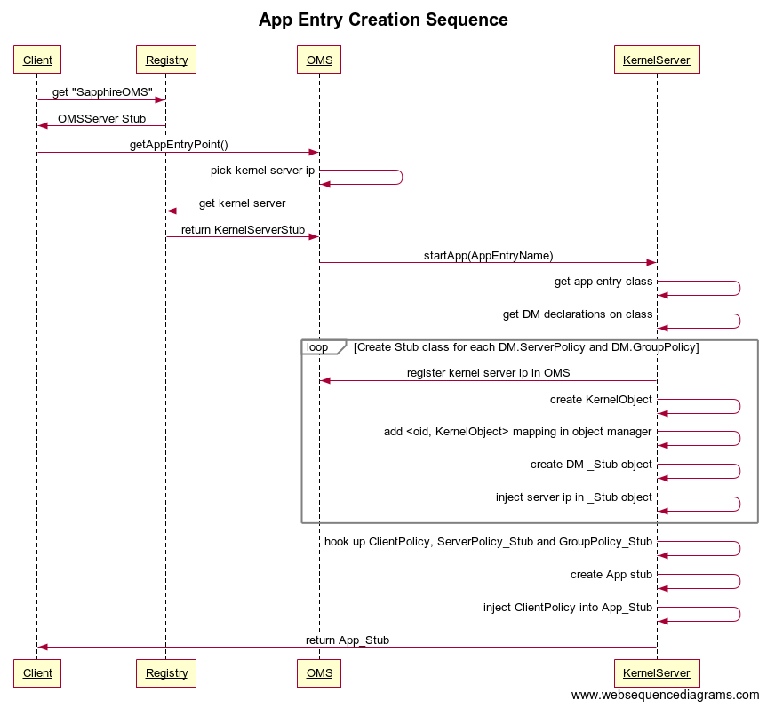

# Amino.Run Overview


### Microservices
Microservices are the base management unit in Amino. In the above diagram, each circle represents one Microservice. The dots inside the circle (i.e. the Microservice) represent normal programming language (e.g. Java) objects. One Microservice may contain a set of such objects. The solid arrow lines between dots are *local* method invocations between objects. The dashed arrow lines between circles are *remote* method invocations between Microservices. Methods on normal Java objects can only be invoked *locally* by objects residing on the same host. Microservices may however have *remote methods* which can be invoked by objects residing on different hosts. 

Deployment Kernel has the capability to move a Microservice from one host to another. Behind the scenes, Deployment Kernel will serialize the whole Microservice, including all programming language objects belonging to the Microservice, on one end, ship the data to the destination host, and then do the deserialization there.

Microservices are created by applications using a static helper method `Microservice.new_()`. To invoke a method on a Microservice, applications have to first get a reference to the Microservice from OMS Server. 

### OMS
OMS, Object Management Service, keeps track of the location of all Microservices. Unlike normal (e.g. Java) objects which can be created using the Java `new` keyword, microsservices must be created with a special Amino.Run helper method 'Microservice.new_()'. Upon Microservice creation, the method `MicroService.new_()` will generate a globally unique ID for the Microservice, and register the object in OMS. OMS provides API to search Amino Run. Given a Microservice ID, OMS can tell the IP of the host on which the Microservice runs. Whenever a Microservice is moved or deleted, OMS will be updated accordingly.

### Kernel Server
Kernel Server provides runtime environment for Amino Run. Each host runs a Kernel Server instance. Kernel Server exposes a set of *remote* API which can be invoked remotely. Amino.Run assumes that any Kernel Server can invoke the *remote* API on any other Kernel Server regardless where the Kernel Server lives.

### DM
Every DM, Deployment Manager, has three components: a proxy, a instance manager, and a coordinator. When users create Microservice, he/she can optionally associate a DM to the Microservice. Not all Microservice has DMs. But if a DM is specified for a Microservice, then during the creation of the Microservice, helper method `MicroService.new_()` will inject code into the `stub` of the Microservice, in which case any method invocation on the Microservice will first be processed by the `proxy`, `instance manager` and the `coordinator` of the DM before reach the actual Microservice. Each DM provides one specific functionality. The Sapphire paper listed 26 DMs. 

### Kernel Object
*Kernel object* is a wrapper of the *actual* (e.g. Java) object - it contains a reference to the actual object and exposes a `invoke` method which allows any public methods defined on the actual object to be invoked with reflection.

Kernel objects are created with [`KernelServerImpl.newKernelObject`](../../core/src/main/java/sapphire/kernel/server/KernelServerImpl.java#L101) method. Every kernel object has a unique `oid` and is registered in OMS server. `KernelServer` interface also exposes a few APIs to copy and move kernel objects.

# Remote Interfaces

Amino.Run declares two `Remote` interfaces: `KernelServer` and `OMSServer`. Most methods in these two interfaces can be easily replaced with `gRPC`, except for `KernelServer.copyKernelObject`.

A note about code snippets: The code below is out-of-date.  Many of the class and package names no longer apply, but the general principles do.

### `KernelServer`

```java
public interface KernelServer extends Remote {
	Object makeKernelRPC(KernelRPC rpc) throws RemoteException, KernelObjectNotFoundException, KernelObjectMigratingException, KernelRPCException;
	void copyKernelObject(KernelOID oid, sapphire.kernel.server.KernelObject object) throws RemoteException, KernelObjectNotFoundException;
	AppObjectStub startApp(String className) throws RemoteException;
}
```

###`OMSServer`
```java
public interface OMSServer extends Remote {
       KernelOID registerKernelObject(InetSocketAddress host) throws RemoteException;
       void registerKernelObject(KernelOID oid, InetSocketAddress host) throws RemoteException, KernelObjectNotFoundException;
       InetSocketAddress lookupKernelObject(KernelOID oid) throws RemoteException, KernelObjectNotFoundException;
       
       ArrayList<InetSocketAddress> getServers() throws NumberFormatException, RemoteException, NotBoundException;
       ArrayList<String> getRegions() throws RemoteException;
       InetSocketAddress getServerInRegion(String region) throws RemoteException;
       
       void registerKernelServer(InetSocketAddress host) throws RemoteException, NotBoundException;
       
       MicroserviceID registerMicroservice(EventHandler dispatcher) throws RemoteException;
       ReplicaID registerReplica(MicroserviceID oid, EventHandler dispatcher) throws RemoteException, MicroserviceNotFoundException;
       EventHandler getMicroserviceDispatcher(MicroserviceID oid) throws RemoteException, MicroserviceNotFoundException;
       EventHandler getReplicaDispatcher(ReplicaID rid) throws RemoteException, MicroserviceNotFoundException;
       
       /* Called by the client */
       public AppObjectStub getAppEntryPoint() throws RemoteException;
}
```

As a remote procedure call framework, `gPRC` does not provide a mechanism to move *objects* from one host to another. *Objects* are different from `gRPC` *messages* because objects may have methods. But we can build this *object moving* capability on top of `gRPC` by taking the following three actions:

* Serialize the object into a byte stream on client side
* Pass the byte stream to server side by calling a `gRPC` function on the server
* Deserialize byte stream into object on server side

However there is one catch. In order to deserialize an object, the server on which the object will be deserialized needs the access to the class definition. `ClassNotFoundException` will be thrown if the server cannot find the class definition on the class path. Unlike `RMI`, `gRPC` is not able to dynamically download class definition from a remote location, therefore we need to build up a mechanism to allow servers to download jar files remotely. 

In the first phase, to keep things simple, we can assume that there is one single jar file which contains all class definitions and this jar file is accessible to all servers.

# RMI Registry 

Amino.Run uses RMI registry to discover remote objects. The following snippet shows how to register remote object *io.amino.run.oms*. 

```java
// Register io.amino.run.oms
OMSServerImpl oms = new OMSServerImpl(args[2]);
sapphire.oms.OMSServer omsStub = (sapphire.oms.OMSServer) UnicastRemoteObject.exportObject(oms, 0);
Registry registry = LocateRegistry.createRegistry(port);
registry.rebind("io.amino.run.oms", omsStub);
```

Client side lookups remote object `OMSServer` by its name, i.e. *io.amino.run.oms*, and RMI registry returns a *stub* of `OMSServer`. Client then uses OMS server to look up Amino Run. 

```java
// Look up io.amino.run.oms
registry = LocateRegistry.getRegistry(args[0],Integer.parseInt(args[1]));
OMSServer server = (OMSServer) registry.lookup("io.amino.run.oms");

// Look up Microservice from OMS Server
TwitterManager tm = (TwitterManager) server.getAppEntryPoint();
System.out.println("Received Twitter Manager Stub: " + tm);
```

If we switch to `gRPC`, we can no longer use RMI registry. We need to come up with another mechanism to register and lookup `gRPC` servers. It should be straightforward to do.

# `gRPC` vs `RMI`

Amino.Run uses `RMI` in its internal implementation. Applications running on top of Amino.Run do not have to use `RMI`. Replacing `RMI` with `gRPC`, if done properly, should have little impact on Amino.Run applications. But application developers must make one change: Amino.Run applications can no longer use RMI registry to find OMS server location; they have to switch to `gRPC` service discovery mechanism.

|      | Pros | Cons |
|------|------|------|
|`gRPC`| * Support other languages<br/> * More efficient | * No object moving|
|`RMI` | * Object moving | * Only support Java<br/> * Less efficient|


# Kernel Server & OMS

`KernelServer` and `OMSServer` are two important objects in Amino.Run. Both expose remote interfaces. `OMSServer` contains a `KernelObjectManager` which keeps track of the mapping between kernel object ID to the IP address of the kernel server in which the object runs. Given an kernel object ID, a client can call `OMSServer` to get the IP of the host where the object runs.

`KernelServer` contains a `ObjectManager` which keeps track of the mapping between kernel object ID to the reference of the object.


The following sequence chart demonstrate the high level interactions between client, OMS Server, and Kernel Server.


# Stubs

Amino.Run generates many `stub` classes. The following chart shows the relationship between these `stub` classes. We then uses the source code to explain how these `stubs` work together to process a remote method invocation. 


### `App_Stub`

`App_Stub` contains `$__client` which is a reference to `ClientPolicy`. Every method call on App object will be translated to an `onRPC` call on embedded `$__client`.

```java
public final class UserManager_Stub extends sapphire.appexamples.minnietwitter.app.UserManager implements sapphire.common.AppObjectStub {

	// holds a reference to client policy
	amino.run.policy.Policy.Client $__client = null;

    // Implementation of addUser(String, String)
    public sapphire.appexamples.minnietwitter.app.User addUser(java.lang.String $param_String_1, java.lang.String $param_String_2)
            throws sapphire.app.AppObjectNotCreatedException {
        java.lang.Object $__result = null;
        try {
            if ($__directInvocation)
                $__result = super.addUser( $param_String_1,  $param_String_2);
            else {
                java.util.ArrayList<Object> $__params = new java.util.ArrayList<Object>();
                String $__method = "public sapphire.appexamples.minnietwitter.app.User sapphire.appexamples.minnietwitter.app.UserManager.addUser(java.lang.String,java.lang.String) throws sapphire.app.AppObjectNotCreatedException";
                $__params.add($param_String_1);
                $__params.add($param_String_2);
                $__result = $__client.onRPC($__method, $__params);
            }
        } catch (Exception e) {
            e.printStackTrace();
        }
        return ((sapphire.appexamples.minnietwitter.app.User) $__result);
    }
```

### `ClientPolicy`

The `onRPC` call on `ClientPolicy` will be translated to an `onRPC` call on `ServerPolicy_Stub`.
 
```java
public abstract class DefaultPolicyUpcallImpl extends amino.run.policy.PolicyLibrary {

	public abstract static class DefaultClientUpcallImpl extends amino.run.policy.PolicyLibrary.ClientLibrary {
		public Object onRPC(String method, ArrayList<Object> params) throws Exception {
			// The default client behavior is to just perform the RPC 
			// to the Policy Server
			Object ret = null;
			try {
				ret = getServer().onRPC(method, params);
			} catch (RemoteException e) {
				setServer(getGroup().onRefRequest());
			}
			return ret;
		}
	}
	
	public abstract static class DefaultServerPolicyUpcallImpl extends ServerPolicyLibrary {
		public Object onRPC(String method, ArrayList<Object> params) throws Exception {
			// The default server behavior is to just invoke 
			// the method on the Microservice this Server 
			// Policy Object manages
			return appObject.invoke(method, params);
		}
	}
}
```

### `ServerPolicy_Stub`
`ServerPolicy_Stub` uses the embedded `KernelClient` to do a `makeKernelRPC` call. It tries to use `makeKernelRPC` call to invoke `DefaultServerPolicyUpcallImpl.onRPC` method on the remote kernel server.

```java
public final class CacheLeasePolicy$CacheLeaseServerPolicy_Stub extends amino.run.policy.cache.CacheLeasePolicy.CacheLeaseServerPolicy implements sapphire.kernel.common.KernelObjectStub {
    // Implementation of onRPC(String, ArrayList) 
    public java.lang.Object onRPC(java.lang.String $param_String_1, java.util.ArrayList $param_ArrayList_2)
            throws java.lang.Exception {
        java.util.ArrayList<Object> $__params = new java.util.ArrayList<Object>();
        String $__method = "public java.lang.Object amino.run.policy.DefaultPolicyUpcallImpl$DefaultServerPolicyUpcallImpl.onRPC(java.lang.String,java.util.ArrayList<java.lang.Object>) throws java.lang.Exception";
        $__params.add($param_String_1);
        $__params.add($param_ArrayList_2);
        java.lang.Object $__result = null;
        try {
            $__result = $__makeKernelRPC($__method, $__params);
        } catch (Exception e) {
            e.printStackTrace();
        }
        return $__result;
    }

	public Object $__makeKernelRPC(java.lang.String method, java.util.ArrayList<Object> params) throws java.rmi.RemoteException, java.lang.Exception {
        sapphire.kernel.common.KernelRPC rpc = new sapphire.kernel.common.KernelRPC($__oid, method, params);
        try {
            return sapphire.kernel.common.GlobalKernelReferences.nodeServer.getKernelClient().makeKernelRPC(this, rpc);
        } catch (sapphire.kernel.common.KernelObjectNotFoundException e) {
            throw new java.rmi.RemoteException();
        }
    }
}
```

### `KernelClient`

`KernelClient` makes a RMI call on a remote `KernelServer` with `server.makeKernelRPC(rpc)`.

```java
public class KernelClient {
	public Object makeKernelRPC(KernelObjectStub stub, KernelRPC rpc) throws KernelObjectNotFoundException, Exception {
		InetSocketAddress host = stub.$__getHostname();
		logger.info("Making RPC to " + host.toString() + " RPC: " + rpc.toString());

		// Check whether this object is local.
		KernelServer server;
		if (host.equals(GlobalKernelReferences.nodeServer.getLocalHost())) {
			server = GlobalKernelReferences.nodeServer;
		} else {
			server = getServer(host);
		}
		
		// Call the server
		try {
			return tryMakeKernelRPC(server, rpc);
		} catch (KernelObjectNotFoundException e) {
			return lookupAndTryMakeKernelRPC(stub, rpc);
		}
	}
	
	private Object tryMakeKernelRPC(KernelServer server, KernelRPC rpc) throws KernelObjectNotFoundException, Exception {
		Object ret = null;
		try {
			ret = server.makeKernelRPC(rpc);
		} catch (KernelRPCException e) {
			throw e.getException();
		} catch (KernelObjectMigratingException e) {
			Thread.sleep(100);
			throw new KernelObjectNotFoundException("Kernel object was migrating. Try again later.");
		}
		return ret;
	}
}
```
### `KernelServer`
The remote `KernelServer` receives the `makeKernelRPC` call. It locates the object in `objectManager` and then calls the method on the object.

```java
	@Override
	public Object makeKernelRPC(KernelRPC rpc) throws RemoteException, KernelObjectNotFoundException, KernelObjectMigratingException, KernelRPCException {
		sapphire.kernel.server.KernelObject object = null;
		object = objectManager.lookupObject(rpc.getOID());
		
		logger.info("Invoking RPC on Kernel Object with OID: " + rpc.getOID() + "with rpc:" + rpc.getMethod() + " params: " + rpc.getParams().toString());
		Object ret = null;
		try {
			ret = object.invoke(rpc.getMethod(), rpc.getParams());
		} catch (Exception e) {
			throw new KernelRPCException(e);
		}
		return ret;
	}
```	

# AppEntry Creation

Every application written using Amino.Run has one `AppEntryPoint` which is the starting point of the application. The following sequence chart shows how a client (e.g. `TwitterWorldGenerator`) gets the `AppEntryPoint` (e.g. `MinnieTwitterStart`) from OMS, and how OMS creates `AppEntryPoint` on Kernel Server behind the scene.



