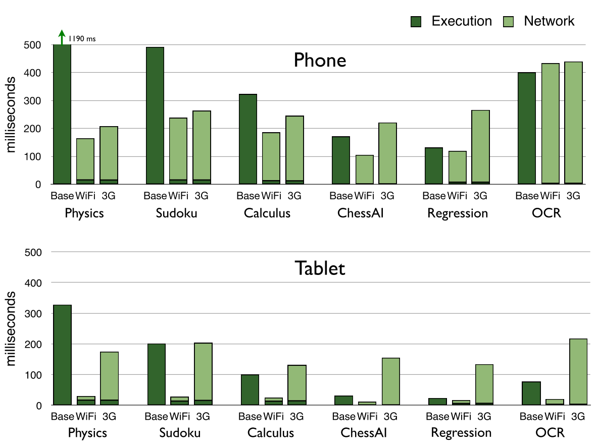

# Design of Code Offloading

## Introduction

Mobile applications are commonly modeled as client server architecture where client components run on mobile devices and server logics are provided by web services in the cloud. Amino.Run, however, provides a mechanism to migrate *client components* between mobile devices and servers in cloud. With the Amino.Run framework, mobile application developers can annotate some client components as `offload-enabled` and specify an offload objective function, e.g. to improve responsiveness, Amino.Run will automatically migrate objects between mobile devices and servers in cloud to maximize the objective function.

* **Client Component Offload**: This design only focuses on client component offload. Migration of server side objects are not considered. What are client components? Client components are objects that are intended to be run on devices. They serve for one specific user, rather than shared by multiple users. 

* **Offload between Device and Cloud**: This design only focuses on migrating objects between mobile devices and servers in cloud. While cloud can be further categorized as *central cloud* and *edge cloud*, to keep things simple, this design does not make such a distinguish.

## Use Cases

* **Moving Object to Improve Responsiveness**: The optimal placement of an object, on a device or on a server, depends on the configuration of the device hardware and the characteristics of the object. The following diagram demonstrates both points. For example, for the OCR application, cloud offloading over Wifi connection works for tablets, but not for phones. Similar, on the same mobile phone, cloud offloading over 3G connection works for Sudoku, but not for ChessAI.



* **Moving Object to Save Power Consumption**: When a mobile device is running low on battery power, we may consider moving objects from device to server, or vice versa, to reduce the power consumption on device. 

## Cost Model

The following cost model is based on the model proposed in [MAUI](https://www.microsoft.com/en-us/research/wp-content/uploads/2010/06/maui.pdf).

* <i>G</i> = <i>(V, E)</i> : Call graph of a mobile app. Each vertex <i>v</i> &isin; <i>V</i> represents a method in the call stack, and each edge <i>e</i> = <i>(u, v)</i> represents an invocation of method <i>v</i> from method <i>u</i>
* <var>E</var><sub><var>v</var></sub><sup>l</sup> : Energy it takes to execute method <var>v</var> locally
* <var>T</var><sub><var>v</var></sub><sup>l</sup> : Time it takes to execute method <var>v</var> locally
* <var>T</var><sub><var>v</var></sub><sup>r</sup> : Time it takes to execute method <var>v</var> remotely
* <var>B</var><sub><var>u,v</var></sub> : Time it takes to transfer necessary program state when <var>u</var> calls <var>v</var>
* <var>C</var><sub><var>u,v</var></sub> : Energy it takes to transfer necessary program state when <var>u</var> calls <var>v</var>
* <var>I<sub>v</sub></var> : Indicator variable. <i>I<sub>v</sub></i> = 0 if method v is executed locally and is 1 if executed remotely
* &Sum;<sub><var>v</var>&isin;<var>V</var></sub> <var>I</var><sub><var>v</var></sub> x <var>E<sub><var>v</var></sub><sup><var>l</var></sup></var> : Total energy saved by running methods remotely
* &Sum;<sub><var>(u,v)</var>&isin;<var>E</var></sub> |<i>I</i><sub><i>u</i></sub> - <i>I</i><sub><i>v</i></sub> | x <i>C</i><sub><i>(u,v)</i></sub> : Total energy it takes to transfer program states for all remote method invocations
* &Sum;<sub><var>v</var>&isin;<var>V</var></sub> ((1 - <var>I</var><sub><var>v</var></sub>) x <var>T</var><sub><var>v</var></sub><sup><var>l</var></sup> + <var>I</var><sub><var>v</var></sub> x <var>T</var><sub><var>v</var></sub><sup><var>r</var></sup>) + &Sum;<sub><var>(u,v)&isin;E</var></sub> (|<var>I</var><sub><var>u</var></sub> - <var>I</var><sub><var>v</var></sub>| x <var>B</var><sub><var>u,v</var></sub>) <= <var>L</var> : The sum of execution times of all method invocations should be less than <var>L</var>
* <var>I</var><sub><var>0</var></sub> ((1 - <var>I</var><sub><var>1</var></sub>) + (1 - <var>I</var><sub><var>2</var></sub>)) + (1 - <var>I</var><sub><var>0</var></sub>)(<var>I</var><sub><var>1</var></sub> + <var>I</var><sub><var>2</var></sub>) == 0 : Forces <var>I<sub>0</sub></var>, <var>I<sub>1</sub></var>, <var>I<sub>2</sub></var> to be at the same location, either all at local or all at remote
* **Model for Energy Saving**:
<div align="center">
<p>
<i>maximize</i>: &Sum;<sub><var>v</var>&isin;<var>V</var></sub> <var>I</var><sub><var>v</var></sub> x <var>E<sub><var>v</var></sub><sup><var>l</var></sup></var> - &Sum;<sub><var>(u,v)</var>&isin;<var>E</var></sub> |<i>I</i><sub><i>u</i></sub> - <i>I</i><sub><i>v</i></sub> | x <i>C</i><sub><i>(u,v)</i></sub></p>
<p>
<i>such that:</i>  &Sum;<sub><var>v</var>&isin;<var>V</var></sub> ((1 - <var>I</var><sub><var>v</var></sub>) x <var>T</var><sub><var>v</var></sub><sup><var>l</var></sup> + <var>I</var><sub><var>v</var></sub> x <var>T</var><sub><var>v</var></sub><sup><var>r</var></sup>) + &Sum;<sub><var>(u,v)&isin;E</var></sub> (|<var>I</var><sub><var>u</var></sub> - <var>I</var><sub><var>v</var></sub>| x <var>B</var><sub><var>u,v</var></sub>) <= <var>L</var></p>
<p>
<i>and</i> <var>I</var><sub><var>v</var></sub> <= <var>r</var><sub><var>v</var></sub>, &forall;<var>v</var> &isin; <var>V</var></p>
<i>and</i> <var>I</var><sub><var>i</var></sub> x &Sum;<sub><var>j</var>&isin;<var>group(i)</var</sub>(1 - <var>I</var><sub><var>j</var></sub>) + (1 - <var>I</var><sub><var>i</var></sub>) x &Sum;<sub><var>j&isin;group(i)</var></sub><var>I<sub>j</sub></var> == 0
</div>

* **Model for Latency Reduction**:
<div align="center">
<p>
<i>minimize:</i> &Sum;<sub><var>v</var>&isin;<var>V</var></sub> ((1 - <var>I</var><sub><var>v</var></sub>) x <var>T</var><sub><var>v</var></sub><sup><var>l</var></sup> + <var>I</var><sub><var>v</var></sub> x <var>T</var><sub><var>v</var></sub><sup><var>r</var></sup>) + &Sum;<sub><var>(u,v)&isin;E</var></sub> (|<var>I</var><sub><var>u</var></sub> - <var>I</var><sub><var>v</var></sub>| x <var>B</var><sub><var>u,v</var></sub>)</p>
<p>
<i>such that:</i> &Sum;<sub><var>v</var>&isin;<var>V</var></sub> (1 - <var>I</var><sub><var>v</var></sub>) x <var>E<sub><var>v</var></sub><sup><var>l</var></sup></var> + &Sum;<sub><var>(u,v)</var>&isin;<var>E</var></sub> |<i>I</i><sub><i>u</i></sub> - <i>I</i><sub><i>v</i></sub> | x <i>C</i><sub><i>(u,v)</i></sub> <= <var>Q</var></p>
<p>
<i>and</i> <var>I</var><sub><var>v</var></sub> <= <var>r</var><sub><var>v</var></sub>, &forall;<var>v</var> &isin; <var>V</var></p>
<i>and</i> <var>I</var><sub><var>i</var></sub> x &Sum;<sub><var>j</var>&isin;<var>group(i)</var</sub>(1 - <var>I</var><sub><var>j</var></sub>) + (1 - <var>I</var><sub><var>i</var></sub>) x &Sum;<sub><var>j&isin;group(i)</var></sub><var>I<sub>j</sub></var> == 0
</div>


```math
# Octave 
# Sum |Iu - Iv|
R = [0, 1, 0, 1]'
L = ones(4, 1) - R
I = G - G .* (L * L') - G .* (R * R')
```

## References
* [MAUI: Making Smartphones Last Longer with Code Offload](https://www.microsoft.com/en-us/research/wp-content/uploads/2010/06/maui.pdf)
* [Framework for context-aware computation offloading in mobile cloud computing](https://journalofcloudcomputing.springeropen.com/articles/10.1186/s13677-016-0071-y)
