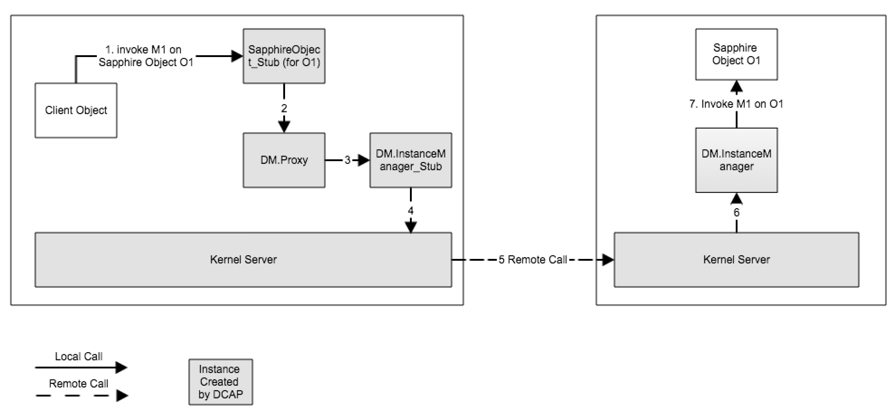
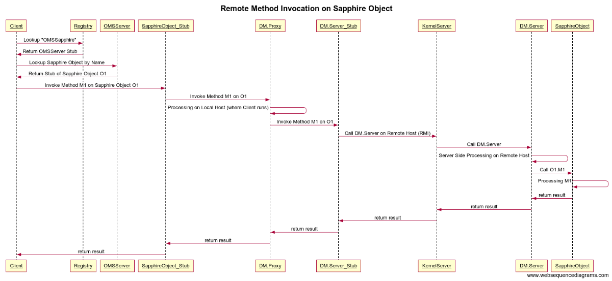

# DM Implementation
Sapphire paper mentions that every DM has three components: a *proxy*, a *instance manager*, and a *coordinator*. The terminologies you see in [source code](https://github.com/Huawei-PaaS/DCAP-Sapphire/blob/master/sapphire/sapphire-core/src/main/java/sapphire/policy/SapphirePolicyUpcalls.java), however, are different from the ones used in the paper. In source code, they are  called *ClientSidePolicy*, *ServerSidePolicy*, and *GroupPolicy*. (This is my understanding. Correct me if I am wrong.) To implement a DM means to write a class that implements the aforementioned three interfaces.

The following interface definitions were copied from [sapphire source  code](https://github.com/Huawei-PaaS/DCAP-Sapphire/blob/master/sapphire/sapphire-core/src/main/java/sapphire/policy/SapphirePolicyUpcalls.java). Be aware that this is **not the final version**. They are subject to future changes. For example, sapphire paper also mentions `onDestroy`, `onLowMemory`, and `onHighLatency` in interfaces. We probably need to add these functions into the interface later. 

```java
// proxy interface
public interface  SapphireClientPolicyUpcalls extends Serializable {
	public void onCreate(SapphireGroupPolicy group);
	public void setServer(SapphireServerPolicy server);
	public SapphireServerPolicy getServer();
	public SapphireGroupPolicy getGroup();
	public Object onRPC(String method, ArrayList<Object> params) throws Exception;
}

// instance manager interface
public interface SapphireServerPolicyUpcalls extends Serializable {
	public void onCreate(SapphireGroupPolicy group);
	public SapphireGroupPolicy getGroup();
	public Object onRPC(String method, ArrayList<Object> params) throws Exception;
	public void onMembershipChange();
}
	
// coordinator interface
public interface SapphireGroupPolicyUpcalls extends Serializable {
	public void onCreate(SapphireServerPolicy server);
	public void addServer(SapphireServerPolicy server);
	public ArrayList<SapphireServerPolicy> getServers();
	public void onFailure(SapphireServerPolicy server);
	public SapphireServerPolicy onRefRequest();
}
```
# DM Usage
App developers use a DM by passing the name of DM class as a generic type to `SapphireObject` interface. In the following example, `UserManager` declares to use DM `DHTPolicy` to manage its users.

```java
public class UserManager implements SapphireObject<DHTPolicy>, DHTInterface {
	Map<DHTKey, User> users;
	private TagManager tm;
    ...
}
```

Again, this is subject to change. We may use Java annotation down the road.

```java
@SapphireObject
@Proxy(name="DHTClient", 
@InstanceManager(name="DHTServer")
@Coordinator(name="DHTCoordinator")
public class UserManager {
}
```
# DM Injection


In the above diagram, the dashed arrow lines are remote method invocations between Sapphire objects, the solid arrow lines are local method invocations within a Sapphire object (i.e. within JVM). DMs sit below Sapphire objects. They are essentially proxies for Sapphire objects. When one object calls a remote method on another Sapphire object, the request will first be processed by the DM on client side, (i.e. `DM.Proxy`), the DM on server side (i.e. `DM.InstanceManager`) , and then finally be sent to the real Java object.

As shown in the following diagram, DM consists of many automatically generated components. All these components are wired up by DCAP automatically. Therefore as an App developer, you cannot use normal Java `new` keyword to create a Sapphire object. Sapphire objects have to be created by [`Sapphire._new()`](https://github.com/Huawei-PaaS/DCAP-Sapphire/blob/master/sapphire/sapphire-core/src/main/java/sapphire/runtime/Sapphire.java). Moreover, to invoke a method on an Sapphire object, you must first get the reference to object from OMS - OMS will return a *stub* of the actual Sapphire object.
 



