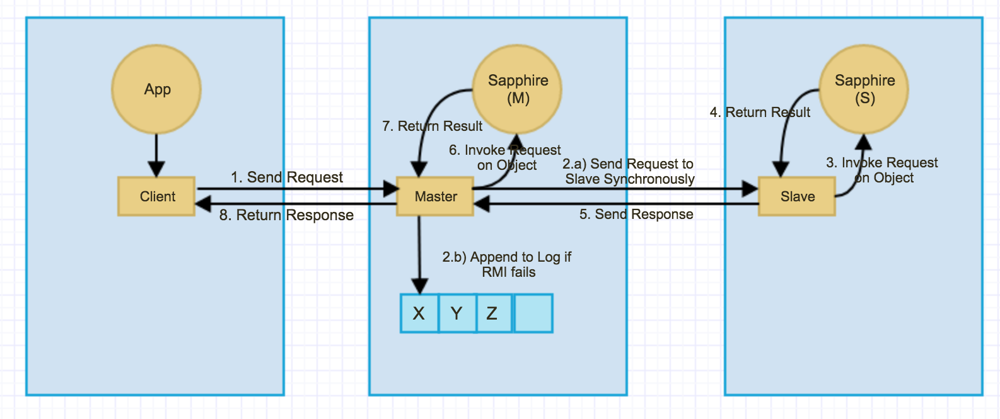
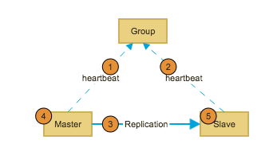
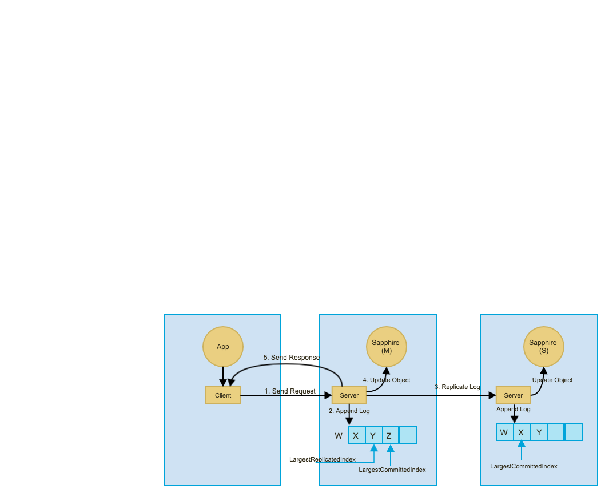

This document describes two master slave DM designs, one with synchronous replication and one with asynchronous replication.

# Table of Content
1. [Master/Slave with Synchronous Replication](#master-slave-with-sync-replication)
2. [Master/Slave with Asynchronous Replication](#master-slave-with-async-replication)

# Master Slave with Sync Replication

## Normal Process
1. Client sends request to master server. Client figures out which replica is master by querying group.
2. Master server replicates the request to slave *synchronously*.
  2.1 If replication fails due to network issues or timeout, master will ignore the error and returns result to client. In this case, the state of master and slave starts to diverge.
  2.2 If replication fails because slave is not up-to-date, master server will sync its current state to slave, and then retry request replication.
3. Slave receives request and invoke request on Sapphire object synchronously.
4. Slave returns result to Master
5. Master returns result to client

When master replicates requests to slave, it will send the ID of the last succeeded request together with the new request. The slave will check if it has successfully received the last succeeded request. If not, it will throw *slave-not-up-to-date* exception to notify master that their states are out of sync. 

## Failure Cases

Above diagram illustrated five primary failure cases.
1. Master is unable to reach Group temporarily. 
2. Slave is unable to reach Group temporarily. 
3. Master cannot reach slave. Replication will fail. Master will keep serving clients. The state between master and slave starts to diverge. Once the network issue is recoverred, 
4. Master is down. In this case, slave will be promoted to be the master.
5. Slave is down. 

### 1. Master unable to reach Group
* Since master is unable to reach group, it cannot renew its lock timely, and therefore it will step down as a slave and refuse client requests.
* After the lock expires, slave will be able to grab the lock, and therefore become the new master.
* Client's requests to the old master are rejected. The client will query the group to get the new master and start to send requests to the new master.

### 2. Slave unable to reach Group
* Nothing to do

### 3. Master cannot reach slave
* Master and slave both alive but the network between them breaks temporarily
* In this case, master will get timeout or network errors when it tries to replicate requests to slave
* Master keeps serving the client. But requests are not replicated to slave. So master and slave will be out of sync during this period.
* When network communication recovers, the master will no longer get timeout or network error when it tries to replicate requests to slave. Instead, the master will get *slave not up to date* error. 
* Upon receiving *slave not up to date* error, master will sync its current state to slave, and retry the replication.
* If succeeds, then master and slave are in sync again.
* If fails, then master will move on and return result to client. In this case, master and slave are still out of sync.

### 4. Master down temporarily
* If master is down, the slave will be promoted to be the new master.
* If the state of the slave is up to date before being promoted to master, then there will be no data loss.
* Client will get errors when it sends requests to old master. Client will query group for the new master, and then starts to send requests to the new master.

### 5. Slave down temporarily 
* This case is similar to the privous network break case
* If slave is down, master will get timeout or network errors when it tries to replicate requests to slave
* Master keeps serving client. But the state of master and slave starts to diverge
* When slave comes back online, the master will get *slave not up to date* error when it tries to replicate requests to slave.
* Upon receiving *slave not up to date* error, master will sync its current state to slave, and retry the replication.
* If succeeds, then master and slave are in sync again.

# Master Slave with Async Replication

## Disclamation
The design of master slave with *asynchronous* replication by design cannot guarantee no data loss.

## Components
Like most DMs, *LoadBalancedMasterSlaveDM* has three components:

* **ClientPolicy**: A Sapphire object with *LoadBalancedMasterSlaveDM* has two replicas: master and slave. Client policy queries *group policy* to figure out master and slave. It sents *muttable* operations to master, and *immutable* operations to one of the replicas in round robin manner.

* **ServerPolicy**: Each replica has its own *server policy*. *Server policies* compete for a lock in *group policy*. The server who owns the lock is the master; the other server is the slave. A server operates either in master mode or in slave mode. In master mode, the server is in charge of appending request to log file, replicating request to slave, and applying request on Sapphire object. In slave mode, the server is in charge of receving replicated requests from master, appending requests to log, and apply requests to Sapphire object. 

* **GroupPolicy**: *Group policy* provides a lock service. It keeps track of the status of master and slave.

## Normal Process

Above diagram shows the normal process sequence:

1. Client sends request to server. Client figures out which replica is master by querying group.
2. Server append the request in log file.
3. Server replicate the request to slave asynchorously. Upon receiving the replicated request, slave appends the request to its log, and apply the request to Sapphire object asynchronously.
4. Server applies request to Sapphire object.
5. Server sends the response back to client.

A few things worth mentioning:

* Log file maintains two pointers: *LargestReplicatedIndex* and *LargestCommittedIndex*. Because master applies every request to its Sapphire object, on master, the LargestCommittedIndex is also the LargestReceivedIndex on the log file. Because master replicates requests to slave asnychronously, LargestReplicatedIndex may sometimes fall bahind LargestCommittedIndex on master. Because every request received by slave is also a successfully replicated request, on slave, the LargestReplicatedIndex on slave is also the LargestReceivedIndex. Because slave applies requests on Sapphire asynchronously, LargestCommittedIndex may sometimes fall behind LargestReplicatedIndex on slave. 

* Server periodically snapshot its log file for failure recovery purpose. Snapshots are stored in a snapshot log file.

* According to the definition of LoadBalancedMasterSlave DM, the replication from master to slave is asynchronous. Due to asynchronous replication, users may experience data loss during fail over. We should probably change it to synchronous replication.

## Implementations

Below are some key classes used in implementation:

* **StateManager**: Keeps track of replica state changes, e.g. between master to slave or vice versa.
* **FileLogger**: Keeps track of log entries and takes snapshot periodically.
* **AsyncReplicator**: Replicates requests from master to slave asynchronously. Only runs in master mode.
* **CommitExecutor**: Apply requests on Sapphire object.
