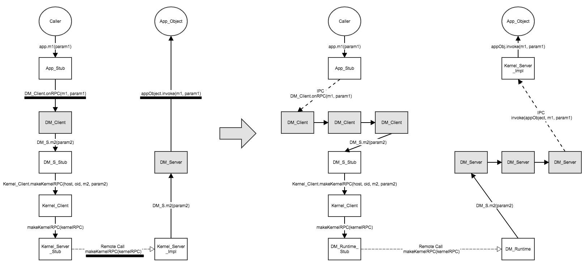

## Background
One of the key [objectives](https://github.com/Huawei-PaaS/DCAP-Sapphire/wiki#objectives) of DCAP is *easy-to-use*. Easy for application developers to use DMs and easy for DM developers to create new DMs. However, after working on Sapphire for a while, I observe a few places which are not easy, sometimes even awkward, to use. 

Modernizing Sapphire core is [a task](https://github.com/Huawei-PaaS/DCAP-Sapphire/wiki/DCAP-Planning#tasks) we plan to undertake. Hopefully these issues can help us drive the redesign of Sapphire core. Feel free to share your thoughts and observations with the team. 

## Issues

#### Impossible to apply multiple DMs on one Sapphire object

Today application developers convert a Java object to Sapphire object by implementing `Sapphire` interface as shown below. The generic type, e.g. `DHTPolicy`, passed into `Sapphire` interface is the DM to be applied. With this design, one Sapphire object can only have one DM. 

But sometimes it is desirable to apply multiple DMs simutaneously. For example, I may want to apply *Cache* DM and *Retry* DM to my Sapphire object in a way such every RPC invocation on Sapphire object will go through a *write-through* cache at client side, and the cache content will be pushed back to server side with *automatic retries*.

```java
public class UserManager implements Sapphire<DHTPolicy> {
    ...
}
```

#### Difficult to build new DM with existing DMs

Today *inheritance* is the only way to reuse codes in other DMs. In the following example, `DurableSerializableRPCPolicy` provides synchronization across invocations in `onRPC` and pass requests to super class for futher processing. 

Java does not support multiple inheritance which means that we can only reuse the codes from one DM at a time. Even in languages that support multiple inheritance, e.g. Python, Go, C++, we still face difficulties. Usually important logic of a DM lies in the `onRPC` method. Suppose we have two DMs with different `onRPC` implementations, we cannot reuse their codes by simply inheriting from them. I agree that we can restructure the codes in a way to make it work - but it is awkward and not intuitive.

As a DM developer, I would like build the *Consensus* DM on top of an existing *Leader-Election* DM, or build the *Distributed-Transaction* DM on top of existing *Consensus* DM. But this is difficult to do with the current Sapphire core.

```java
public class DurableSerializableRPCPolicy extends PeriodicCheckpointPolicy {
    ....
}
```

#### Impossible to cherry pick DM component

Every DM has three components: *Client*, *Server*, and *Group*. As a DM user, when I apply a DM to my Sapphire object, I have to carry all three components (i.e. client, server, group) at the same time. It will be great if the system allows users to cherry pick components, e.g. use *retry* DM on client side together with *locking* DM on server side.

```java
public class DurableSerializableRPCPolicy extends PeriodicCheckpointPolicy {
    public static class ClientPolicy extends PeriodicCheckpointPolicy.ClientPolicy {}
    public static class ServerPolicy extends PeriodicCheckpointPolicy.ServerPolicy {}
    public static class GroupPolicy extends PeriodicCheckpointPolicy.GroupPolicy {}
}
```

## Proposals

#### Proposal I
Comparing to the current Sapphire DM structure (left diagram), the new DM structure (right diagram) proposes two changes:
* Client DM is replaced with a chain of client side DMs. Similarly, server DM is replaced with a chain of server side DMs too. In the current Sapphire core, DMs are assembled by code generator at compilation phase. The proposed structure allows Saaphire  to assemble DMs at runtime.
* DMs and App objects run in two different processes. Method invocations between App object and DM are replaced with inter-process communications. DMs only need to be implemented once. DMs can be implemented in any languages. 



## Thoughts

#### Framework vs Code Generation

#### Library vs Inheritance

#### Side car vs DM
