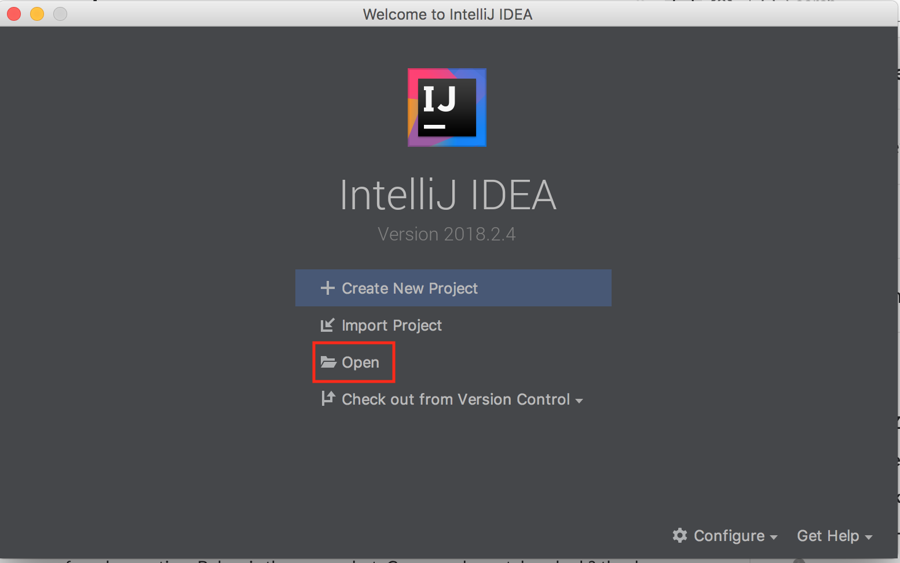

# Onboarding Process

* Send public GitHub account, Slack account and Huawei email address to Sungwook (sungwook.moon@huawei.com)
* Join [slack workspace](https://huawei.slack.com/)
* Get access to GitHub Repo by contacting Sungwook
* Read [papers](https://sapphire.cs.washington.edu/research/)
* Read [Sapphire source code](https://sapphire.cs.washington.edu/code.html)
* Read [code study notes](./code_study/)
* Read [github workflow guide](https://github.com/kubernetes/community/blob/master/contributors/guide/github-workflow.md). Please follow this workflow to submit pull requests.
* [Set up Android Studio](https://github.com/Huawei-PaaS/DCAP-Sapphire/blob/master/docs/Development.md)
* Review the Principles of Distributed Systems. If you have not done a university course on distributed systems you will need to read the following to get a basic understanding of the principles and common terminology. Feel free to add more resource links below.
  * [UMass Course 677](http://lass.cs.umass.edu/~shenoy/courses/677/)
  * [Distributed System Principles by Andrew Tanenbaum](https://www.amazon.com/Distributed-Systems-Principles-Andrew-Tanenbaum/dp/153028175X)


# Quick Start
## Download and install GraalVM Community Edition
* You will need to download and install the corrrect version (usually the latest stable version) 
  based on the dependency configured in 
  [sapphire/sapphire-core/build.gradle](https://github.com/Huawei-PaaS/DCAP-Sapphire/blob/master/sapphire/sapphire-core/build.gradle). 
  As of March 2019, that's 
  [GraalVM Community Edition 1.0 RC14](https://github.com/oracle/graal/releases/tag/vm-1.0.0-rc14).
  Note that the open source Community Edition works fine, so don't bother with the Enterprise Edition unless 
  you have a specific need for it.
  Follow instructions at  https://www.graalvm.org/docs/getting-started/ for downloading and installing.
  In particular, set your JAVA_HOME and PATH variables appropriately.  For example, something along the lines of the following at the end of your ~/.bash_profile in your home directory works well on Linux and Mac OS X:
```  
export GRAALVM_HOME=~/Downloads/graalvm-ce-1.0.0-rc14/Contents/Home
export JAVA_HOME=$GRAALVM_HOME
export PATH=$GRAALVM_HOME/bin:$PATH
```
  After then, you need to install ruby support for GraalVM:
```
gu install ruby
```

## Install Android SDK and Android Studio (or IntelliJ)
* Follow [instructions](https://developer.android.com/studio/) to install Android SDK and Anroid Studio. More details can be found at [here](https://wiki.appcelerator.org/display/guides2/Installing+the+Android+SDK#InstallingtheAndroidSDK-InstallingAndroidSDKToolsonmacOS).
* Android SDK and Android Studio are *not* required by Amino. But many Amino demo applications are android applications. We recommend installing Android SDK and Android Studio.
```shell
// on Mac
$ brew cask install android-sdk
$ brew cask install android-ndk
```

### Accept Android SDK License
```shell
// on Mac
$ /usr/local/share/android-sdk/tools/bin/sdkmanager --licenses
```

### Add Android Properties
```shell
> cd DCAP_Sapphire/sapphire
> cat >> local.properties  << EOF
ndk.dir=<your ndk dir>
sdk.dir=<your sdk dir>
EOF
```

## Getting and Building the Source Code

### Check out Sapphire from Github
```shell
# checkout sapphire
$ git clone https://github.com/Huawei-PaaS/DCAP-Sapphire
```

### Build and Test Sapphire Core
```shell
# build sapphire-core
> cd DCAP_Sapphire/sapphire/sapphire-core
> ../gradlew build

### Other gradle tasks and tips

#### List Sapphire Projects
```shell
> cd DCAP_Sapphire/sapphire
> ./gradlew projects
```

#### Clean Sapphire
```shell
# clean sapphire-core and dependencies
> cd DCAP_Sapphire/sapphire
> ./gradlew clean

# clean only sapphire-core
> ./gradlew :sapphire-core:clean
```

#### Format Source Code
```shell
# format source code
> cd DCAP_Sapphire/sapphire
> ./gradlew goJF

# verify source code style
> ./gradlew verGJF
```

#### Generate Policy Stub
```shell
> cd DCAP_Sapphire/sapphire/sapphire-core
> ../gradlew genStubs
```

### Other Gradle Tips
```shell
> ./gradlew projects
> ./gradlew tasks --all
> ./gradlew properties
> ./gradlew jar
```

## Release

### Publish Sapphire Core to Bintray 
```shell
export BINTRAY_USER="<bintray_user>"
export BINTRAY_API_KEY="<bintray_api_key>"

# publish sapphire-core to bintray
> ./gradlew --info :sapphire-core:bintrayUpload

# publish apache harmony to bintray
> ./gradlew --info :apache.harmony:bintrayUpload
```


### Build and Test Basic Example Applications
#### Build and Run Hankstodo, a simple TODO list manager
```shell
> cd DCAP_Sapphire/sapphire
> # Run the Object Management System
> ./gradlew :examples:hanksTodo:runoms
> # In a new terminal window: Run a Kernel Server
> ./gradlew :examples:hanksTodo:runks
> # In a new terminal window: Run the Application
> ./gradlew :examples:hanksTodo:runapp
```

# IntelliJ Tips
* If you decide to use IntelliJ instead of Android Studio, use *Open* to open the Sapphire project, 
  as *Import* may not work properly.


