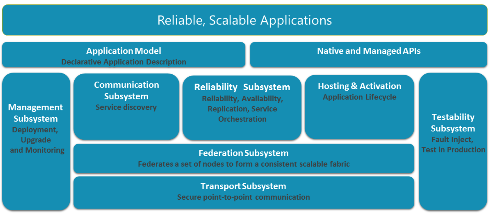

## Architect


## Features

#### Availability of Service Fabric stateful services
A stateful service has a state associated with it. In Service Fabric, a stateful service is modeled as a set of replicas. Each replica is a running instance of the code of the service. The replica also has a copy of the state for that service. Read and write operations are performed at one replica, called the *Primary*. Changes to state from write operations *are replicated* to the other replicas in the replica set, called Active Secondaries, and applied.

There can be only one Primary replica, but there can be multiple Active Secondary replicas. The number of active Secondary replicas is configurable, and a higher number of replicas can tolerate a greater number of concurrent software and hardware failures.

#### Partition Service Fabric stateful services
Service Fabric makes it easy to develop scalable stateful services by offering a first-class way to partition state (data). Conceptually, you can think about a partition of a stateful service as a scale unit that is highly reliable through replicas that are distributed and balanced across the nodes in a cluster.

#### Storing service state
State can be either externalized or co-located with the code that is manipulating the state. Externalization of state is typically done by using an external database or other data store that runs on different machines over the network or out of process on the same machine. 

*State can also be co-located with the code that manipulates the state*. Stateful services in Service Fabric are typically built using this model. Service Fabric provides the infrastructure to ensure that this state is highly available, consistent, and durable, and that the services built this way can easily scale.

#### Reliable Collections
Reliable Collections can be thought of as the natural evolution of the System.Collections classes: a new set of collections that are designed for the cloud and multi-computer applications without increasing complexity for the developer. As such, Reliable Collections are:

* Replicated: State changes are *replicated* for high availability.
* Persisted: Data is *persisted* to disk for durability against large-scale outages (for example, a datacenter power outage).
* Asynchronous: APIs are *asynchronous* to ensure that threads are not blocked when incurring IO.
* Transactional: APIs utilize the abstraction of *transactions* so you can manage multiple Reliable Collections within a service easily.

## Implementation
```
---------------------------------------------------------------------------------------
Language                             files          blank        comment           code
---------------------------------------------------------------------------------------
C++                                   3595         213705          73663        1039755
C/C++ Header                          4542         104234          52473         365869
JSON                                   120            507              0          26452
CMake                                  212           1260            154           9345
XML                                    107             65            128           5215
XSD                                      1              9             12           3383
Bourne Shell                            60            610            444           3244
C                                       18           1138            193           1260
Windows Module Definition               15             10              6            429
Bourne Again Shell                      10             69             34            339
Python                                   2            125             82            288
Markdown                                 5            104              0            234
HTML                                     1             41              4            193
Dockerfile                               3             12              4             65
Perl                                     2             14              4             54
awk                                      1              2              0             16
YAML                                     1              2              1             16
---------------------------------------------------------------------------------------
SUM:                                  8695         321907         127202        1456157
---------------------------------------------------------------------------------------
```
## References
* [Service Fabric Git Repo](https://github.com/Microsoft/service-fabric)
* [Service Fabric Doc](https://docs.microsoft.com/en-us/azure/service-fabric)
* [Orleans Doc](https://dotnet.github.io/orleans/Documentation/Introduction.html)
